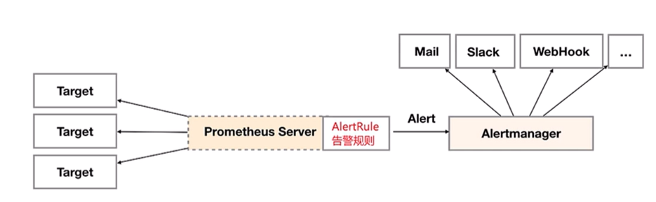
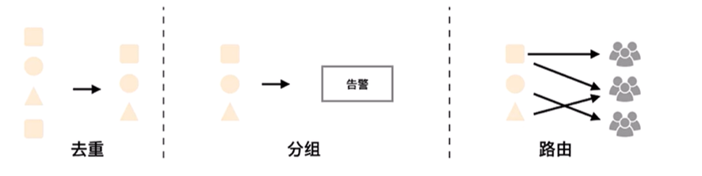
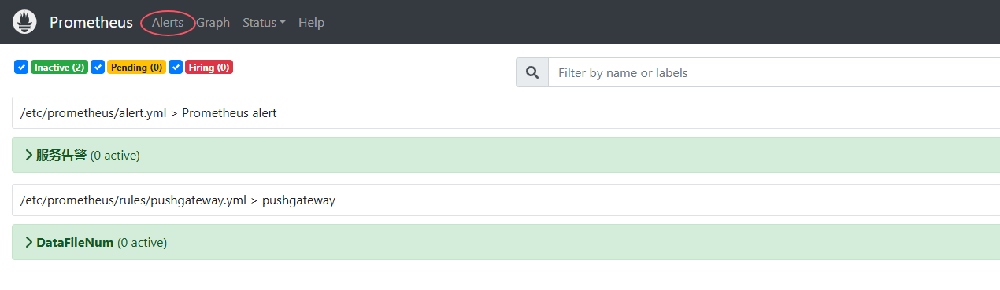
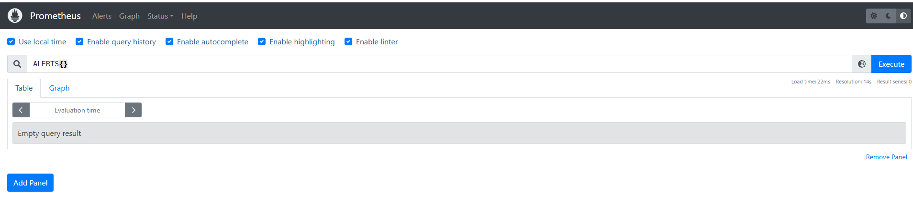

# alertmanager

告警能力在Prometheus的架构中被划分成两个独立的部分。如下所示，通过在Prometheus中定义AlertRule（告警规则），Prometheus会周期性的对告警规则进行计算，如果满足告警触发条件就会向Alertmanager发送告警信息



Alertmanager作为一个独立的组件，负责接收并处理来自Prometheus Server(也可以是其它的客户端程序) 的告警信息。**Alertmanager可以对这些告警信息进行进一步的处理，比如当接收到大量重复告警时能够消除重复的告警信息，同时对告警信息进行分组并且路由到正确的通知方**，Prometheus内置了对邮件，Slack等多种通知方式的支持，同时还支持与Webhook的集成，以支持更多定制化的场景。例如，目前还不支持钉钉，那用户完全可以通过Webhook与钉钉机器人进行集成，从而通过钉钉接收告警信息。同时AlertManager 提供了静默和告警抑制机制来对告警通知行为进行优化

## 1. Alertmanager特性
AlertManager除了提供基本的告警通知能力外，还主要提供了如：分组、抑制以及静默等告警特性



### 1.1 分组
**分组机制可以将详细的告警信息合并成一个通知**。在某些情况下，比如由于系统宕机导致大量的告警被同时触发，在这种情况下分组机制可以将这些被触发的告警合并为一个告警通知，避免一次性接受大量的告警通知，而无法对问题进行快速定位

例如，当集群中有数百个正在运行的服务实例，并且为每一个实例设置了告警规则。假如此时发生了网络故障，可能导致大量的服务实例无法连接到数据库，结果就会有数百个告警被发送到Alertmanager

而作为用户，可能只希望能够在一个通知中就能查看哪些服务实例收到影响。这时可以按照服务所在集群或者告警名称对告警进行分组，而将这些告警内聚在一起成为一个通知

告警分组，告警时间，以及告警的接受方式可以通过**Alertmanager的配置文件进行配置**

### 1.2 抑制
抑制是指当某一告警发出后，可以停止重复发送由此告警引发的其它告警的机制

例如，当集群不可访问时触发了一次告警，通过配置Alertmanager可以忽略与该集群有关的其它所有告警。这样可以避免接收到大量与实际问题无关的告警通知

抑制机制同样通过**Alertmanager的配置文件进行设置**

### 1.3 静默
静默提供了一个简单的机制可以快速根据标签对告警进行静默处理。如果接收到的告警符合静默的配置，Alertmanager则不会发送告警通知。

静默设置需要在**Alertmanager的Web页面上进行设置**


## 2. Alertmanager的配置概述
Alertmanager主要负责对Prometheus产生的告警进行统一处理，因此在Alertmanager配置中一般会包含以下几个主要部分：
* 全局配置（global）：用于定义一些全局的公共参数，如全局的SMTP配置，Slack配置等内容
* 模板（templates）：用于定义告警通知时的模板，如HTML模板，邮件模板等
* 告警路由（route）：根据标签匹配，确定当前告警应该如何处理
* 接收人（receivers）：接收人是一个抽象的概念，它可以是一个邮箱也可以是微信，Slack或者Webhook等，接收人一般配合告警路由使用
* 抑制规则（inhibit_rules）：合理设置抑制规则可以减少垃圾告警的产生

其完整配置格式如下：
```
global:
  [ resolve_timeout: <duration> | default = 5m ]
  [ smtp_from: <tmpl_string> ]
  [ smtp_smarthost: <string> ]
  [ smtp_hello: <string> | default = "localhost" ]
  [ smtp_auth_username: <string> ]
  [ smtp_auth_password: <secret> ]
  [ smtp_auth_identity: <string> ]
  [ smtp_auth_secret: <secret> ]
  [ smtp_require_tls: <bool> | default = true ]
  [ slack_api_url: <secret> ]
  [ victorops_api_key: <secret> ]
  [ victorops_api_url: <string> | default = 
"https://alert.victorops.com/integrations/generic/20131114/alert/" ]
  [ pagerduty_url: <string> | default = "https://events.pagerduty.com/v2/enqueue" ]
  [ opsgenie_api_key: <secret> ]
  [ opsgenie_api_url: <string> | default = "https://api.opsgenie.com/" ]
  [ hipchat_api_url: <string> | default = "https://api.hipchat.com/" ]
  [ hipchat_auth_token: <secret> ]
  [ wechat_api_url: <string> | default = "https://qyapi.weixin.qq.com/cgi-bin/" ]
  [ wechat_api_secret: <secret> ]
  [ wechat_api_corp_id: <string> ]
  [ http_config: <http_config> ]
templates:
  [ - <filepath> ... ]
route: <route>
receivers:
  - <receiver> ...
inhibit_rules:
  [ - <inhibit_rule> ... ]
```
* 在全局配置中需要注意的是resolve_timeout，该参数定义了当Alertmanager持续多长时间未接收到告警后标记告警状态为resolved（已解决）。该参数的定义可能会影响到告警恢复通知的接收时间，可根据自己的实际场景进行定义，其默认值为5分钟。在接下来的部分，将以一些实际的例子解释Alertmanager的其它配置内容

**案例**： 简单配置
```
global:
  #163服务器
  smtp_smarthost: 'smtp.163.com:465'
  #发邮件的邮箱
  smtp_from: 'cdring@163.com'
  #发邮件的邮箱用户名，也就是你的邮箱　　　　　
  smtp_auth_username: 'cdring@163.com'
  #发邮件的邮箱密码
  smtp_auth_password: 'your-password'
  #进行tls验证
  smtp_require_tls: false

route:
  group_by: ['alertname']
  # 当收到告警的时候，等待group_wait配置的时间，看是否还有告警，如果有就一起发出去
  group_wait: 10s
  #  如果上次告警信息发送成功，此时又来了一个新的告警数据，则需要等待group_interval配置的时间才可以发送出去
  group_interval: 10s
  # 如果上次告警信息发送成功，且问题没有解决，则等待repeat_interval配置的时间再次发送告警数据
  repeat_interval: 10m
  # 全局报警组，这个参数是必选的
  receiver: email

receivers:
- name: 'email'
  #收邮件的邮箱
  email_configs:
  - to: 'cdring@163.com'
inhibit_rules:
 - source_match:
     severity: 'critical'
   target_match:
     severity: 'warning'
   equal: ['alertname', 'dev', 'instance']
```

## 3. Prometheus告警规则
Prometheus中的告警规则允许基于PromQL表达式定义告警触发条件，Prometheus后端对这些触发规则进行周期性计算，当满足触发条件后则会触发告警通知。默认情况下，用户可以通过Prometheus的Web界面查看这些告警规则以及告警的触发状态。当Promthues与Alertmanager关联之后，可以将告警发送到外部服务如Alertmanager中并通过Alertmanager可以对这些告警进行进一步的处理
* 告警规则是配置在Prometheus服务器

### 3.1 与Alertmanager关联
Prometheus把产生的告警发送给Alertmanager进行告警处理时，需要在Prometheus使用的配置文件中添加关联 Alertmanager组件的对应配置内容
* 编辑prometheus.yml文件加入关联Alertmanager组件的访问地址，示例如下
```
# Alertmanager 配置
alerting:
  alertmanagers:
  - static_configs:
    - targets: ['alertmanager:9093']
```
* 添加监控Alertmanager，让Prometheus去收集Alertmanager的监控指标
```
- job_name: 'alertmanager'
  # 覆盖全局默认值，每15s从该作业中刮取一次目标
  scrape_interval: 15s
  static_configs:
  - targets: ['alertmanager:9093']
```
* 重新加载Prometheus的配置
```
curl -X POST http://localhost:9090/-/reload
```

### 3.2 配置告警规则
* 创建告警配置文件
```
#进入到prometheus docker安装目录
cd /data/prometheus
vim prometheus/alert.yml
```
* 告警规则配置如下
```
groups:
- name: Prometheus alert
  rules:
  # 对任何实例超过1分钟无法联系的情况发出警报
  - alert: 服务告警
    expr: up == 0
    for: 1m
    labels:
      severity: critical
    annotations:
      summary: "服务异常,实例:{{ $labels.instance }}"
      description: "{{ $labels.job }} 服务已关闭"
```

在告警规则文件中，可以将一组相关的规则设置定义在一个group下。在每一个group中可以定义多个告警规则 (rule)。一条告警规则主要由以下几部分组成:
* alert：告警规则的名称
* expr：基于PromQL表达式告警触发条件，用于计算是否有时间序列满足该条件
* for：评估等待时间，可选参数。用于表示只有当触发条件持续一段时间后才发送告警。在等待期间新产生告警的状态为pending
* labels：自定义标签，允许用户指定要附加到告警上的一组附加标签
* annotations：用于指定一组附加信息，比如用于描述告警详细信息的文字等，annotations的内容在告警产生时会一同作为参数发送到Alertmanager

### 3.3 加载告警规则
为了能够让Prometheus能够启用定义的告警规则，需要在Prometheus全局配置文件中通过`rule_files`指定一组告警规则文件的访问路径，Prometheus启动后会自动扫描这些路径下规则文件中定义的内容，并且根据这些规则计算是否向外部发送通知, `rule_files`是全局配置
* 格式
```
rule_files:
  [ - <filepath_globb> ... ]
```
* 具体配)
```
# 报警(触发器)配置
rule_files:
  - "alert.yml"
  - "rules/*.yml"
```
* 重载配置
```
curl -X POST http://localhost:9090/-/reload
```

### 3.4 查看告警状态
重启Prometheus后，用户可以通过Prometheus WEB界面中的Alerts菜单查看当前Prometheus下的所有告警规则，以及其当前所处的活动状态



同时对于已经pending或者firing的告警，Prometheus也会将它们存储到时间序列`ALERTS {}`中, 可以通过表达式，查询告警实例:



### 3.5 测试告警

