# install Prometheus with docker

## 1. 安装docker

### 1.1 镜像加速
```
sudo mkdir -p /etc/docker
sudo tee /etc/docker/daemon.json <<-'EOF'
{
  "registry-mirrors": ["http://hub-mirror.c.163.com"]
}
EOF
```

### 1.2 安装docker
```
export DOWNLOAD_URL="http://mirrors.163.com/docker-ce"
curl -fsSL https://get.docker.com/ | sh
```

### 1.3 检查
```
docker -v
或：
systemctl status docker
```

## 2. 安装docker-compose


## 3. 安装Prometheus/Grafana/Alertmanager
```
mkdir /data
git clone https://gitee.com/linge365/docker-prometheus.git
cd docker-prometheus
docker-compose up -d
```
* prometheus: 9090
* grafana: 3000
* alertmanager: 9093
* cadvisor: 8080
* node-exporter: 9100

## 4. 使用Grafana展示Prometheus数据

### 4.1 登录Grafana
* 登录Grafana: http://192.168.50.120:3000
* 默认用户名和密码: admin/password

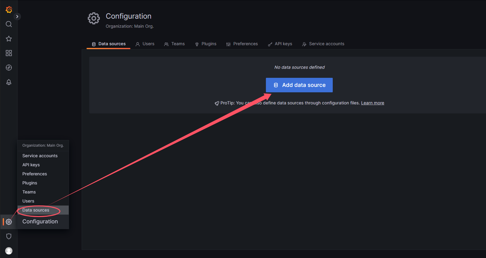
* 点击`Add data source`

### 4.2 添加Prometheus数据源
添加Prometheus数据源: http://prometheus:9090
* 这里的`prometheus`是Prometheus的容器名，可根据实际情况修改，比如二进制部署的时候，修改成主机的IP地址

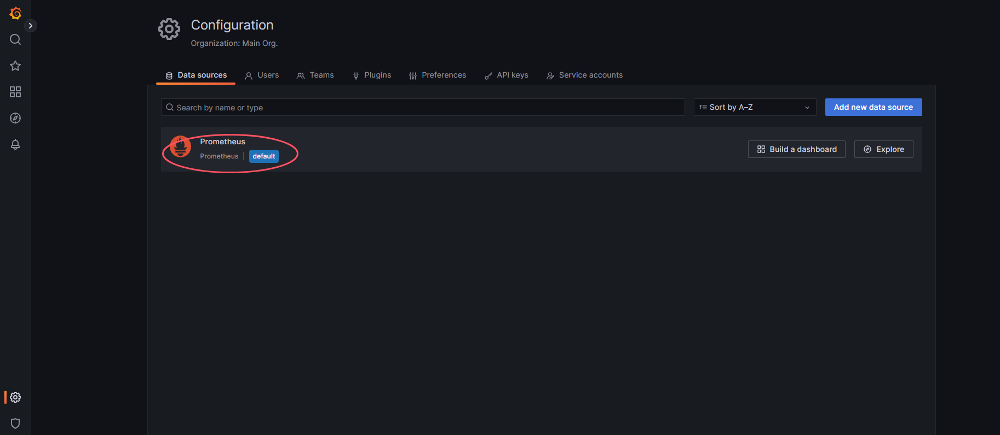

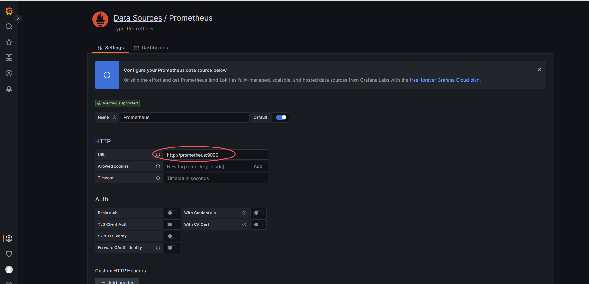

拉到底部，点击`Save & Test`

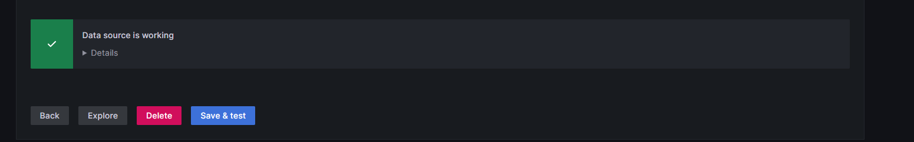

## 5. 导入Grafana模板
* 导入Grafana模板: https://grafana.com/grafana/dashboards/

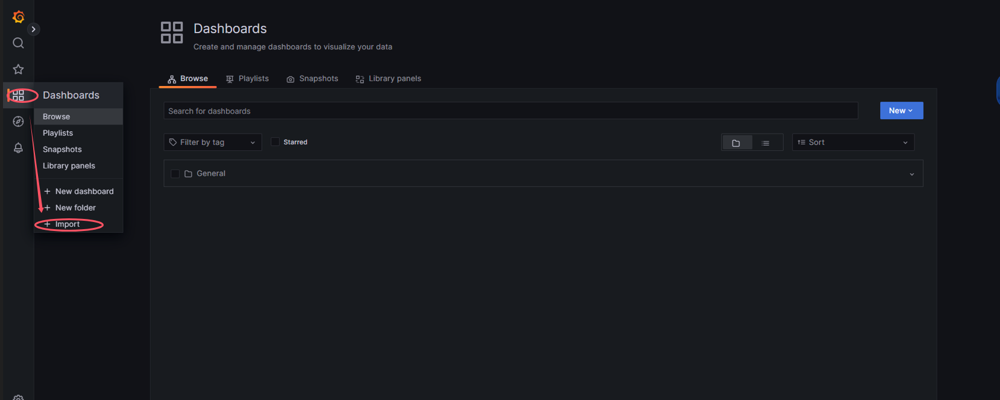

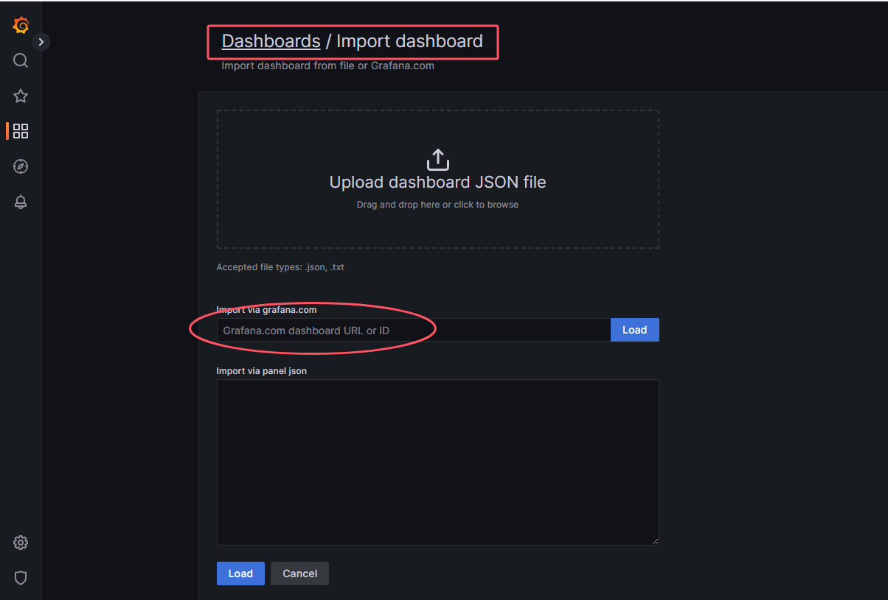

在grafana dashboard官网搜索`node exporter`，找到`Node Exporter Full`的模板ID，这里我们选择`Node Exporter Full`的模板ID为`1860`

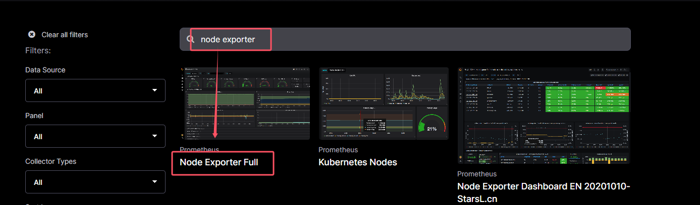

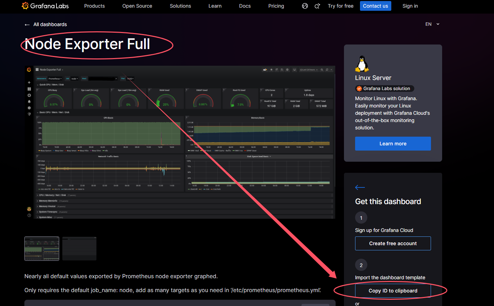

* 将拷贝的模板ID粘贴到grafana的模板ID中，点击`Load`

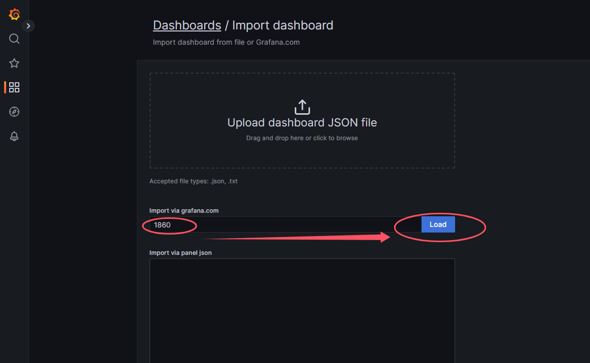

* 选择`Prometheus`数据源，点击`Import`

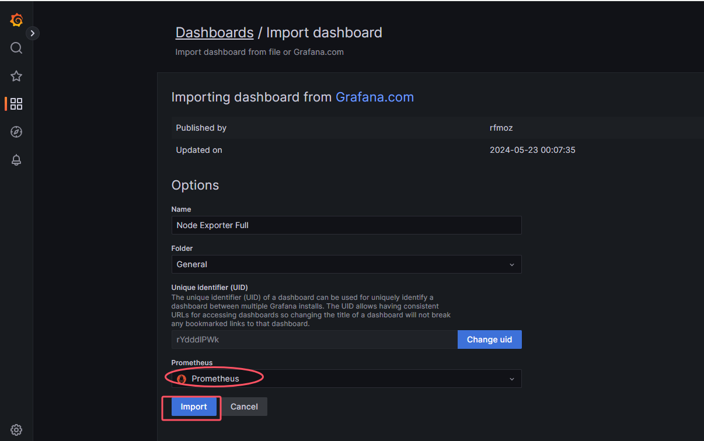

* 导入后的效果如下

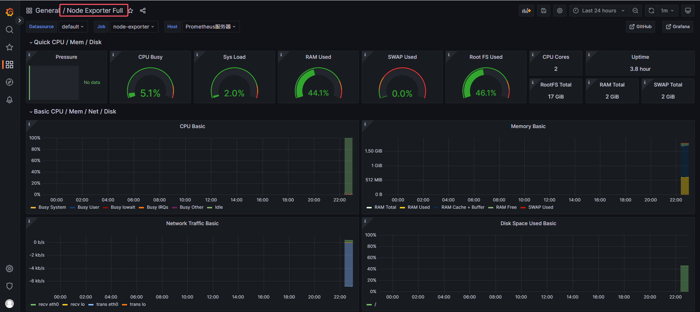

* 这里的`Node Exporter Full`可以通过settings进行修改

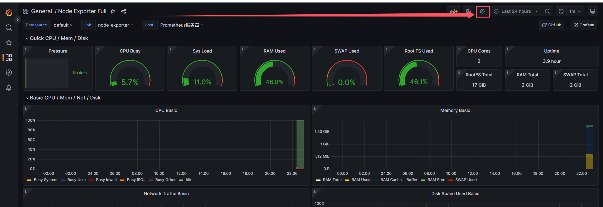

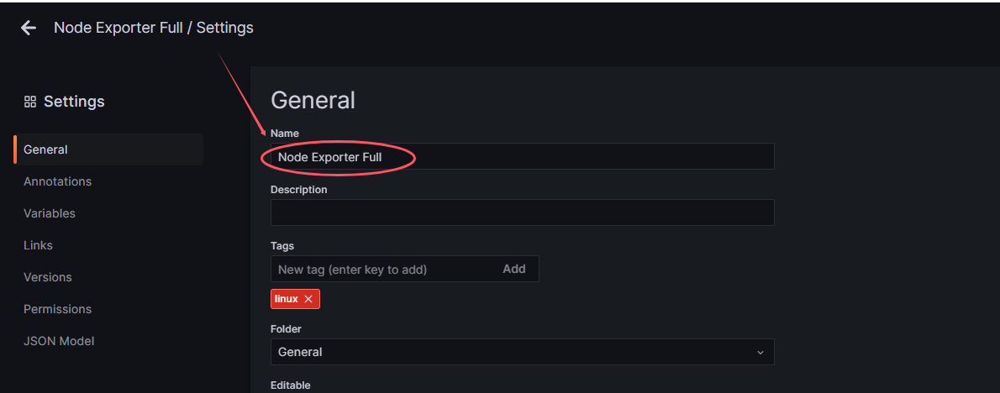

