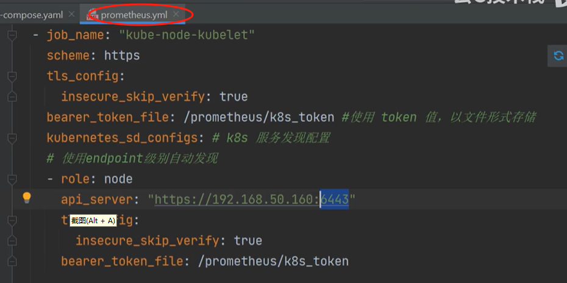
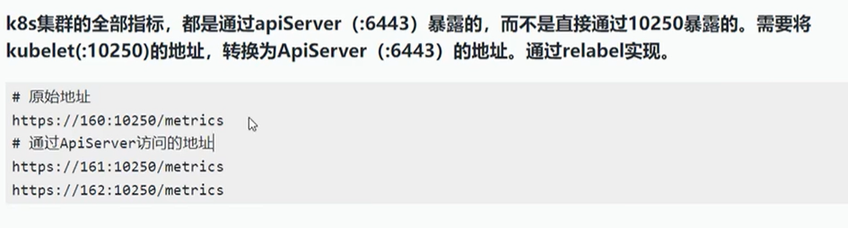
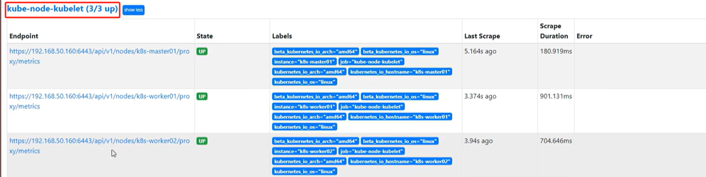
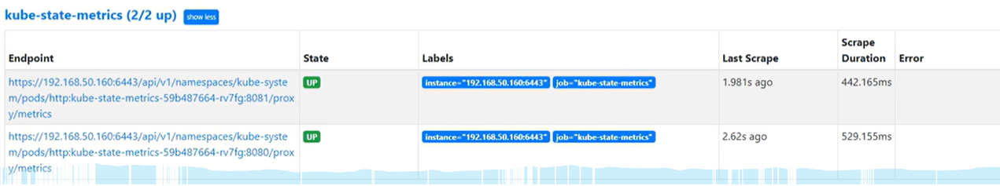
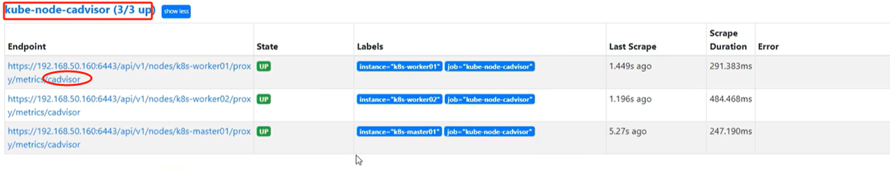

# 监控k8s

## 1. 配置Prometheus





```
- job_name: "kube-node-kubelet"
  scheme: https
  tls_config:
    insecure_skip_verify: true
  bearer_token_file: /prometheus/k8s_token # 使用 token 值，以文件形式存储
  kubernetes_sd_configs: # k8s 服务发现配置
  # 使用endpoint级别自动发现
  - role: node # 表示 Prometheus 将通过 Kubernetes API Server 发现集群中的节点（Node）
    api_server: "https://192.168.50.160:6443"
    tls_config:
      insecure_skip_verify: true
    bearer_token_file: /prometheus/k8s_token

  relabel_configs:
    # 将标签(.*)作为新标签名，原有值不变; action: labelmap 表示执行标签映射操作
    - action: labelmap
      regex: __meta_kubernetes_node_label_(.*)  # regex: __meta_kubernetes_node_label_(.*) 是一个正则表达式，它匹配以 __meta_kubernetes_node_label_ 开头的元数据标签，并将这些标签转换为普通的 Prometheus 标签。例如，如果节点有一个标签 __meta_kubernetes_node_label_role=worker，它将被转换为 role=worker
    # 修改NodeIP:10250为APIServerIP:6443
    # regex: (.*) 是一个通配符正则表达式，replacement: 192.168.50.160:6443 表示将所有节点的地址替换为指定的 Kubernetes API Server 地址 192.168.50.160:6443。这是因为 kubelet 的指标接口通常只能通过 API Server 进行访问
    - action: replace # 表示执行替换操作
      regex: (.*)
      source_labels: [ __address__ ] # source_labels: [ __address__ ] 指定了源标签为 __address__
      target_label: __address__ # target_label: __address__ 表示将替换后的结果仍然存储在 __address__ 标签中
      replacement: 192.168.50.160:6443
    # 实际访问指标接口 https://NodeIP:10250/metrics 这个接口只能APISERVER访问，故此重新打标签
    # regex: (.*) 匹配节点名称，replacement: /api/v1/nodes/${1}/proxy/metrics 构建了实际的指标访问路径，其中 ${1} 表示引用匹配到的节点名称，这样就可以为每个节点生成正确的指标访问路径，例如 /api/v1/nodes/k8s-node-01/proxy/metrics
    - action: replace
      source_labels: [ __meta_kubernetes_node_name ] # source_labels: [ __meta_kubernetes_node_name ] 表示使用节点名称作为源标签
      target_label: __metrics_path__ # target_label: __metrics_path__ 表示将替换后的结果存储在 __metrics_path__ 标签中
      regex: (.*)
      replacement: /api/v1/nodes/${1}/proxy/metrics
      # 192.168.50.160:6443/api/v1/nodes/k8s-master01/proxy/metrics
      # 192.168.50.160:6443/api/v1/nodes/k8s-worker01/proxy/metrics
      # 192.168.50.160:6443/api/v1/nodes/k8s-worker02/proxy/metrics
```

* kube-node-kubelet


* kube-state-metrics

```
- job_name: "kube-state-metrics"
  scheme: https
  tls_config:
    insecure_skip_verify: true
  #使用apiserver授权部分解密的token值，以文件形式存储
  bearer_token_file: /prometheus/k8s_token
  # k8s自动发现具体配置
  kubernetes_sd_configs:
    - role: endpoints
      api_server: "https://192.168.50.160:6443"
      tls_config:
        insecure_skip_verify: true
        bearer_token_file: /prometheus/k8s_token
  relabel_configs:
    - action: keep
      source_labels: [ __meta_kubernetes_service_name ]
      regex: '^(kube-state-metrics)$'
    # 将标签(.*)作为新标签名，原有值不变
    #
    # - action: labelmap
    #   regex: __meta_kubernetes_service_label_(.*)
    # 修改NodeIP:10250为APIServerIP:6443
    - action: replace
      regex: (.*) 
```

* kube-node-cadvisor
  * 如何在Prometheus中配置这些job的配置
