# 黑盒监控

## 1. 黑盒监控和白盒监控

“白盒监控”-- 需要把对应的Exporter程序安装到被监控的目标主机上，从而实现对主机各种资源及其状态的数据采集工作

但是由于某些情况下操作技术或其他原因，不是所有的Exporter都能部署到被监控的主机环境中，最典型的例子是监控全国网络质量的稳定性，通常的方法是使用 ping 操作，对选取的节点进行 ICMP 测试，此时不可能在他人应用环境中部署相关的 Exporter 程序

针对这样的应用场景，Prometheus社区提供了黑盒解决方案，Blackbox Exporter无须安装在被监控的目标环境中，用户只需要将其安装在与Prometheus和被监控目标互通的环境中，通过 、HTTP、HTTPS、DNS、TCP、ICMP等方式对网络进行探测监控，还可以探测SSL证书过期时间。

blackbox_exporter
* Prometheus官方提供的exporter之一，可以提供http、dns、tcp、icmp的监控数据采集

## 2. blackbox exporter安装

### 2.1 二进制方式


### 2.2 docker方式
* 创建目录
```
mkdir /data/blackbox_exporter
cd /data/blackbox_exporter
```

* 创建配置文件
```
cat > /data/blackbox_exporter/config.yml<<EOF
modules:
  http_2xx:
    prober: http
    http:
      method: GET
      preferred_ip_protocol: "ip4"
  http_post_2xx:
    prober: http
    http:
      method: POST
  tcp_connect:
    prober: tcp
  pop3s_banner:
    prober: tcp
    tcp:
      query_response:
      - expect: "^+OK"
      tls: true
      tls_config:
        insecure_skip_verify: false
  grpc:
    prober: grpc
    grpc:
      tls: true
      preferred_ip_protocol: "ip4"
  grpc_plain:
    prober: grpc
    grpc:
      tls: false
      service: "service1"
  ssh_banner:
    prober: tcp
    tcp:
      query_response:
      - expect: "^SSH-2.0-"
      - send: "SSH-2.0-blackbox-ssh-check"
  irc_banner:
    prober: tcp
    tcp:
      query_response:
        - send: "NICK prober"
        - send: "USER prober prober prober :prober"
        - expect: "PING :([^ ]+)"
        - send: "PONG "
        - expect: ":[^ ]+ 001" 
  icmp:
    prober: icmp
  icmp_ttl5:
    prober: icmp
    timeout: 5s
    icmp:
      ttl: 5
EOF
```

* 运行blackbox container
```
docker run -d --restart=always --name blackbox-exporter -p 9115:9115 -v /data/blackbox_exporter:/etc/blackbox_exporter docker.1ms.run/prom/blackbox-exporter --config.file=/etc/blackbox_exporter/config.yml
```
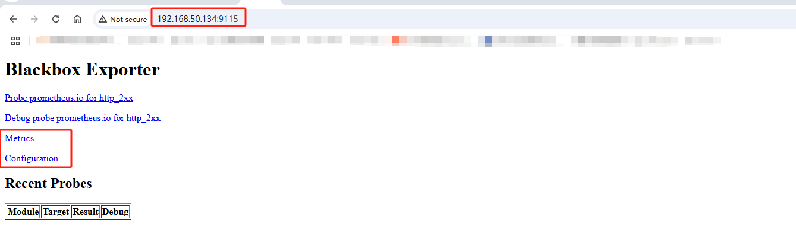

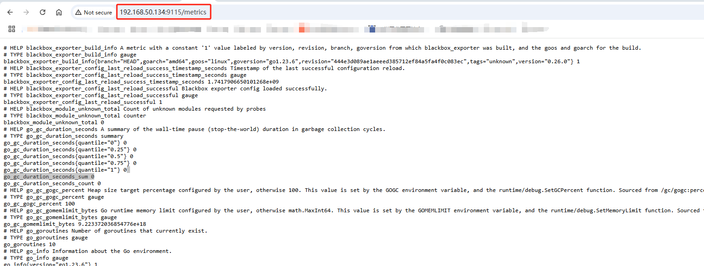

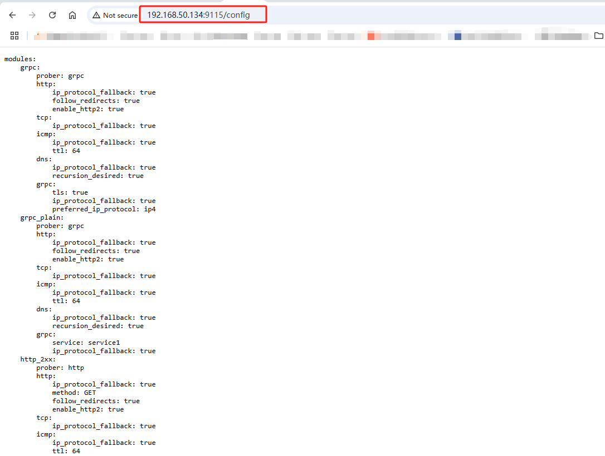


## 3. 配置Prometheus
配置Prometheus去采集(拉取)blackbox_exporter的监控样本数据
```
cat >> /data/docker-prometheus/prometheus/prometheus.yml <<"EOF"
#http配置
- job_name: "blackbox_http"
  metrics_path: /probe
  params:
    module: [http_2xx]
  static_configs:
    - targets:
      - https://www.baidu.com   # 要测试的domain，根据实际情况进行替换
      - https://www.163.com
  relabel_configs:
    - source_labels: [__address__]
      target_label: __param_target
    - source_labels: [__param_target]
      target_label: instance
    - target_label: __address__
      replacement: 192.168.50.134:9115 # 黑盒子的地址，即blackbox exporter的地址
#tcp检查配置
- job_name: "blackbox_tcp"
  metrics_path: /probe
  params:
    module: [tcp_connect]
  static_configs:
    - targets:
      - 192.168.50.120:22
      - 192.168.50.120:9090
  relabel_configs:
    - source_labels: [__address__]
      target_label: __param_target
    - source_labels: [__param_target]
      target_label: instance
    - target_label: __address__
      replacement: 192.168.50.134:9115
#icmp检查配置 ping
- job_name: "blackbox_icmp"
  metrics_path: /probe
  params:
    module: [icmp]
  static_configs:
    - targets:
      - 192.168.50.120
      - 192.168.50.134
      - 192.168.50.199
  relabel_configs:
    - source_labels: [__address__]
      target_label: __param_target
    - source_labels: [__param_target]
      target_label: instance
    - target_label: __address__
      replacement: 192.168.50.134:9115
EOF
```

* 加载Prometheus
```
curl -X POST http://192.168.50.120:9090/-/reload
```

* 检查
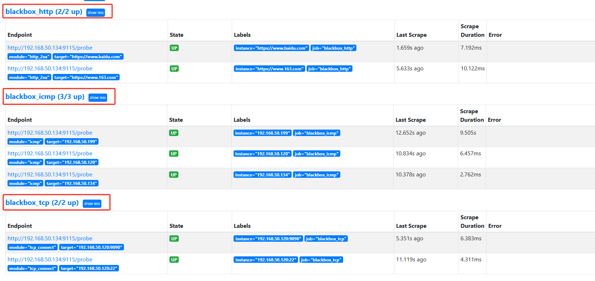


## 4. 常见的指标
指标以`probe_`开头

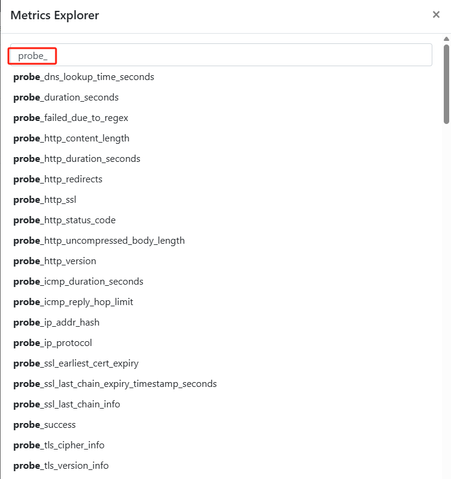

* probe_success # 是否探测成功（取值 1、0 分别表示成功、失败）
* probe_duration_seconds # 探测的耗时
#### 关于 DNS
* probe_dns_lookup_time_seconds # DNS 解析的耗时
* probe_dns_protocol # IP 协议，取值 4、6
* probe_ip_addr_hash # IP 地址的哈希值，用于判断 IP 是否变化
### 关于 HTTP
* probe_http_status_code # HTTP 响应的状态码。如果发生重定向，则取决于最后一次响应
* probe_http_content_length # HTTP 响应的 body 长度，单位 bytes
* probe_http_version # HTTP 响应的协议版本，比如 1.1
* probe_http_ssl # HTTP 响应是否采用 SSL ，取值为 1、0
* probe_ssl_earliest_cert_expiry # SSL 证书的过期时间，为 Unix 时间戳

---
### probe_success
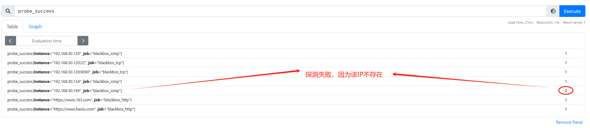

### probe_http_status_code
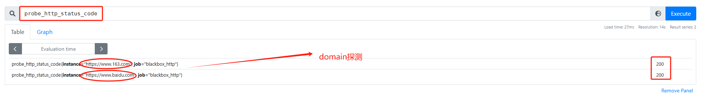


## 5. 配置Prometheus触发器
* 添加告警配置
```
cat >> /data/docker-prometheus/prometheus/rules/blackbox_exporter.yml <<"EOF"
groups:
- name: Blackbox
  rules:
  - alert: 黑盒子探测失败告警
    expr: probe_success == 0
    for: 1m
    labels:
      severity: critical
    annotations:
      summary: "黑盒子探测失败{{ $labels.instance }}"
      description: "黑盒子检测失败，当前值：{{ $value }}"
  - alert: 请求慢告警
    expr: avg_over_time(probe_duration_seconds[1m]) > 1
    for: 1m
    labels:
      severity: warning
    annotations:
      summary: "请求慢{{ $labels.instance }}"
      description: "请求时间超过1秒，值为：{{ $value }}"
  - alert: http状态码检测失败
    expr: probe_http_status_code <= 199 OR probe_http_status_code >= 400
    for: 1m
    labels:
      severity: critical
    annotations: 
      summary: "http状态码检测失败{{ $labels.instance }}"
      description: "HTTP状态码非200-399，当前状态码为：{{ $value }}"
  - alert: ssl证书即将到期
    expr: probe_ssl_earliest_cert_expiry - time() < 86400 * 30
    for: 1m
    labels:
      severity: warning
    annotations:
      summary: "证书即将到期{{ $labels.instance }}"
      description: "SSL 证书在30天后到期，值：{{ $value }}"
  - alert: ssl证书即将到期
    expr: probe_ssl_earliest_cert_expiry - time() < 86400 * 3
    for: 1m
    labels:
      severity: critical
    annotations: 
      summary: "证书即将到期{{ $labels.instance }}"
      description: "SSL 证书在 3 天后到期，值：{{ $value }}"
  - alert: ssl证书已过期
    expr: probe_ssl_earliest_cert_expiry - time() <= 0
    for: 1m
    labels:
      severity: critical
    annotations:
      summary: "证书已过期{{ $labels.instance }}"
      description: "SSL 证书已经过期，请确认是否在使用"
EOF
```

* 校验Prometheus配置
```
docker exec -it prometheus promtool check config /etc/prometheus/prometheus.yml
```

* 加载Prometheus配置
```
curl -X POST http://192.168.50.120:9090/-/reload
```

## 5. 添加Grafana面板
ID: 9965 (缺点是显示为中文)
https://grafana.com/grafana/dashboards/9965-1-blackbox-exporter-dashboard-20220412/


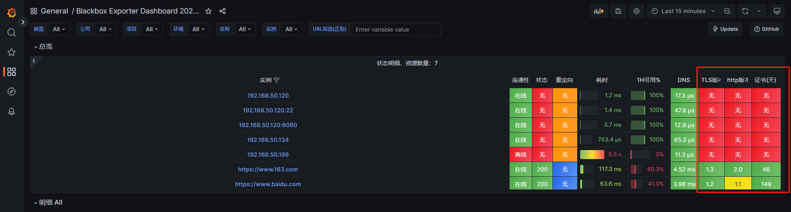

## 问题：
### http探测失败
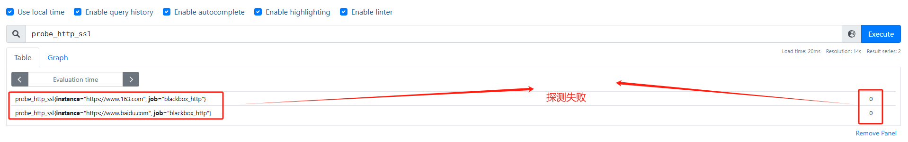

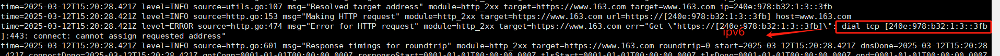

=> 修改http get探测配置，优先ipv4
```
  http_2xx:
    prober: http
    http:
      method: GET
      preferred_ip_protocol: "ip4"
```

### dashboard指标名称显示不对
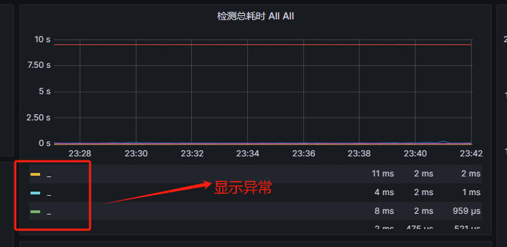

=> 编辑这个panel

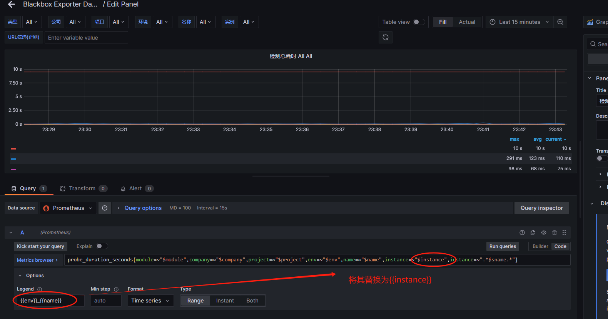

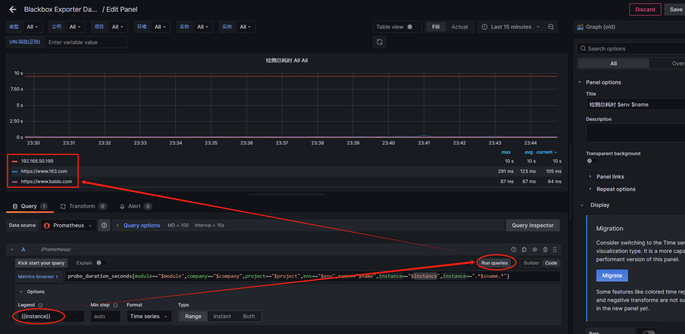