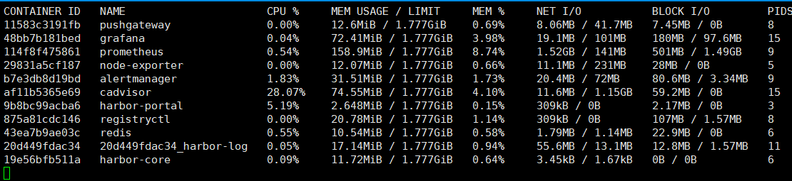
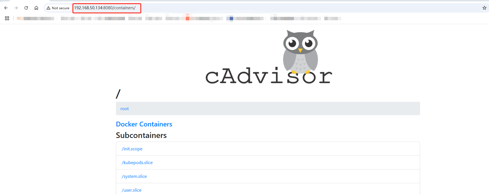
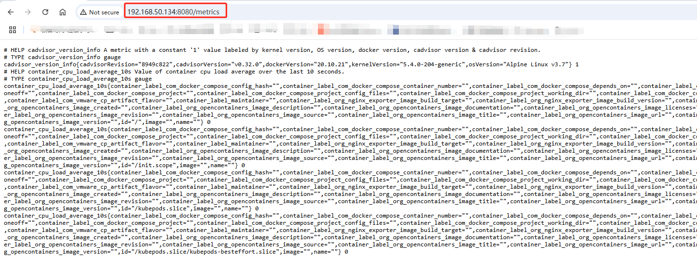
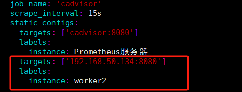
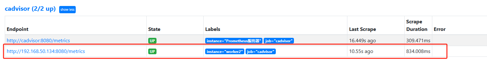
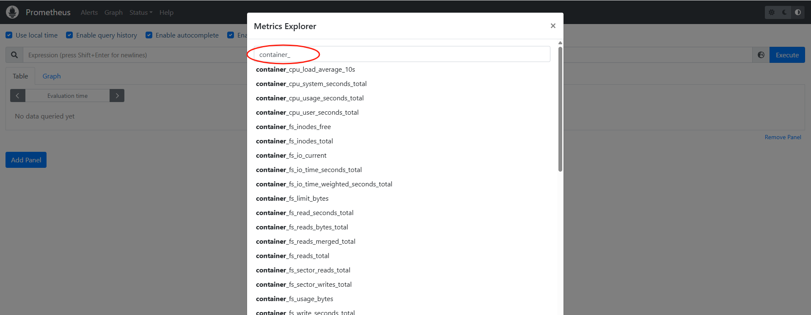
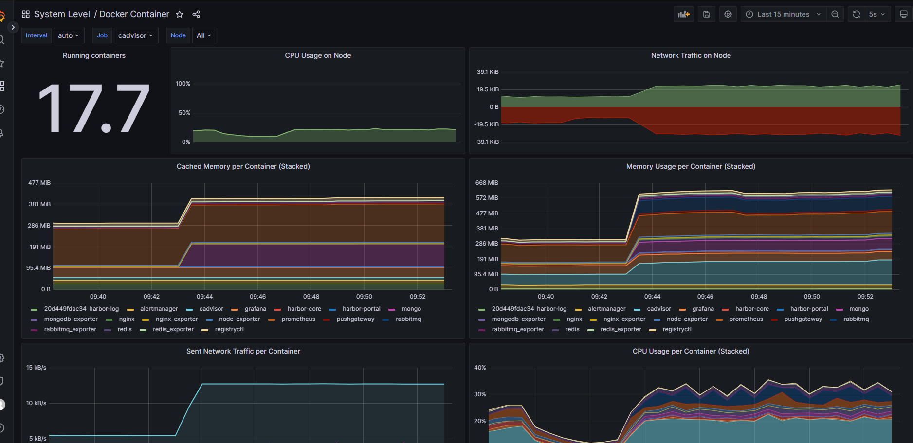

# docker monitor

## 1. 通过命令行docker stats



## 2. 使用cAdvisor
cAdvisor是Google开源的一款用于展示和分析容器运行状态的可视化工具。通过在主机上运行 cAdvisor用户可以轻松的获取到当前主机上容器的运行统计信息，并以图表的形式向用户展示

### 2.1 docker安装cAdvisor
```
docker run -d \
--volume=/:/rootfs:ro \
--volume=/var/run:/var/run:rw \
--volume=/sys:/sys:ro \
--volume=/var/lib/docker:/var/lib/docker:ro \
--publish=8080:8080 \
--name=cadvisor \
docker.1ms.run/google/cadvisor:latest
```

* 通过访问http://192.168.50.134:8080可以查看当前主机上容器的运行状态，如下所示


* 访问http://192.168.50.134:8080/metrics即可获取到标准的Prometheus监控样本输出


### 2.2 将其添加到Prometheus

```
  - job_name: 'cadvisor'
    scrape_interval: 15s
    static_configs:
    - targets: ['cadvisor:8080']
      labels:
        instance: Prometheus服务器
    - targets: ['192.168.50.134:8080']
      labels:
        instance: worker2
```

### 2.3 加载Prometheus配置文件
```
curl -X POST http://192.168.50.120:9090/-/reload
```



## 3. 常见的指标
以`container_`开头的指标是cAdvisor采集的

指标名称	                             类型	            含义
* container_cpu_load_average_10s	        gauge	    过去 10 秒容器 CPU 的平均负载
* container_cpu_usage_seconds_total	    counter	    容器在每个 CPU 内核上的累积占用时间 (单位：秒)
* container_cpu_system_seconds_total	    counter	    System CPU 累积占用时间 (单位：秒)
* container_cpu_user_seconds_total	    counter	    User CPU 累积占用时间 (单位：秒)
* container_fs_usage_bytes	            gauge	    容器中文件系统的使用量 (单位：字节)
* container_fs_limit_bytes	            gauge	    容器可以使用的文件系统总量 (单位：字节)
* container_fs_reads_bytes_total	        counter	    容器累积读取数据的总量 (单位：字节)
* container_fs_writes_bytes_total	        counter	    容器累积写入数据的总量 (单位：字节)
* container_memory_max_usage_bytes	    gauge	    容器的最大内存使用量 (单位：字节)
* container_memory_usage_bytes	        gauge	    容器当前的内存使用量 (单位：字节)
* container_spec_memory_limit_bytes	    gauge	    容器的内存使用量限制
* machine_memory_bytes	                gauge	    当前主机的内存总量
* container_network_receive_bytes_total	counter	    容器网络累积接收数据总量 (单位：字节)
* container_network_transmit_bytes_total	counter	    容器网络累积传输数据总量 (单位：字节)



## 4. Prometheus触发器设置
* 配置Prometheus告警规则
```
cat > /data/docker-prometheus/prometheus/rules/docker.yml <<"EOF"
groups:
- name: DockerContainers
  rules:
  - alert: ContainerKilled
    expr: time() - container_last_seen > 60
    for: 0m
    labels:
      severity: warning
    annotations:
      summary: "Docker容器被杀 死 容器: $labels.instance"
      description: "{{ $value }}个容器消失了"
    # This rule can be very noisy in dynamic infra with legitimate container start/stop/deployment.
  - alert: ContainerAbsent
    expr: absent(container_last_seen)
    for: 5m
    labels:
      severity: warning
    annotations:
      summary: "无容器 容器: $labels.instance"
      description: "5分钟检查容器不存在，值为：{{ $value }}"
  - alert: ContainerCpuUsage
    expr: (sum(rate(container_cpu_usage_seconds_total{name!=""}[3m])) BY (instance, name) * 100) > 300
    for: 2m
    labels:
      severity: warning
    annotations:
      summary: "容器cpu使用率告警 容器: $labels.instance"
      description: "容器cpu使用率超过300%，当前值为：{{ $value }}"
  - alert: ContainerMemoryUsage
    expr: (sum(container_memory_working_set_bytes{name!=""}) BY (instance, name) / sum(container_spec_memory_limit_bytes > 0) BY (instance, name) * 100) > 80
    for: 2m
    labels:
      severity: warning
    annotations:
      summary: "容器内存使用率告警 容器: $labels.instance"
      description: "容器内存使用率超过80%，当前值为：{{ $value }}"
  - alert: ContainerVolumeIoUsage
    expr: (sum(container_fs_io_current{name!=""}) BY (instance, name) * 100) > 80
    for: 2m
    labels:
      severity: warning
    annotations:
      summary: "容器存储io使用率告警 容器: $labels.instance"
      description: "容器存储io使用率超过 80%，当前值为：{{ $value }}"
  - alert: ContainerHighThrottlerate
    expr: rate(container_cpu_cfs_throttled_seconds_total[3m]) > 1
    for: 2m
    labels:
      severity: warning
    annotations:
      summary: "容器限制告警 容器: $labels.instance"
      description: "容器被限制，当前值为：{{ $value }}"
EOF
```

* 校验Prometheus配置
```
docker exec -it prometheus promtool check config /etc/prometheus/prometheus.yml
```

* 加载Prometheus配置
```
curl -X POST http://192.168.50.120:9090/-/reload
```

## 5. 添加Grafana面板
ID： 11600




