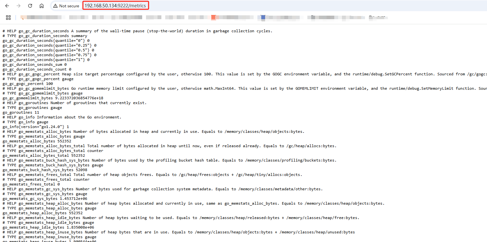
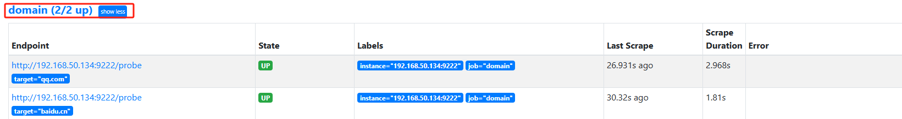
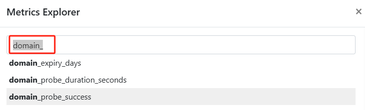
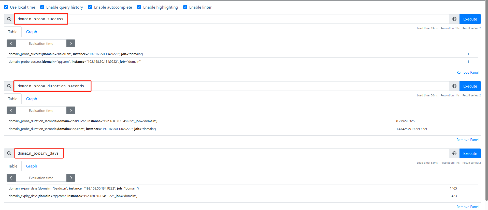
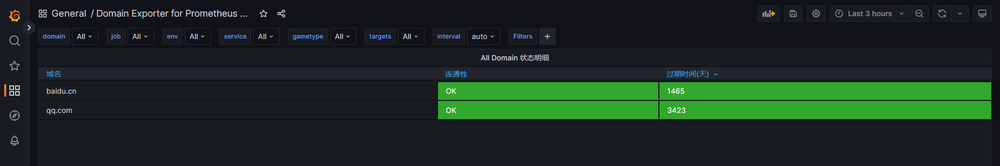
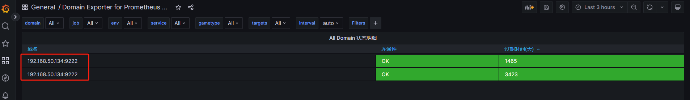
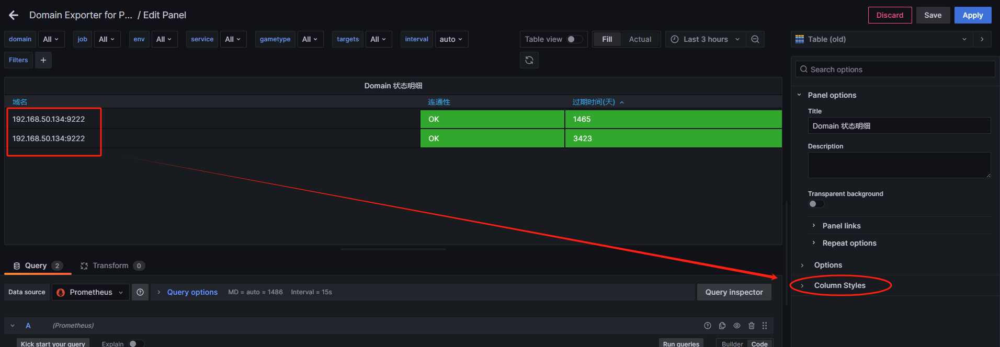
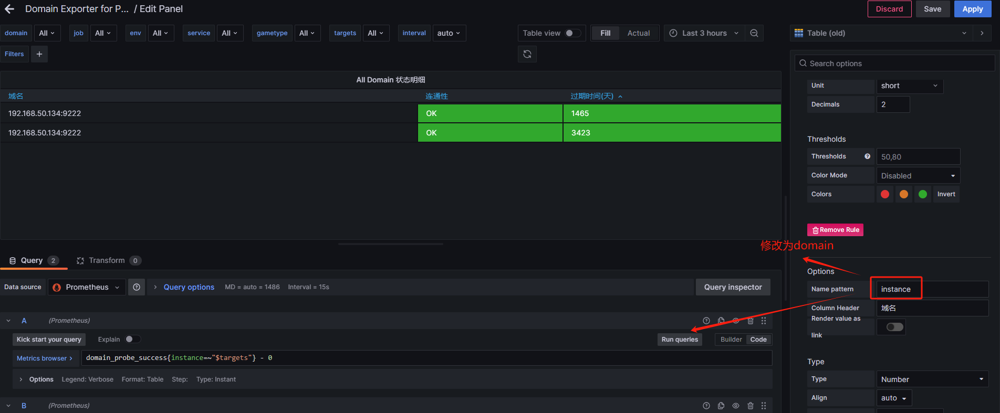
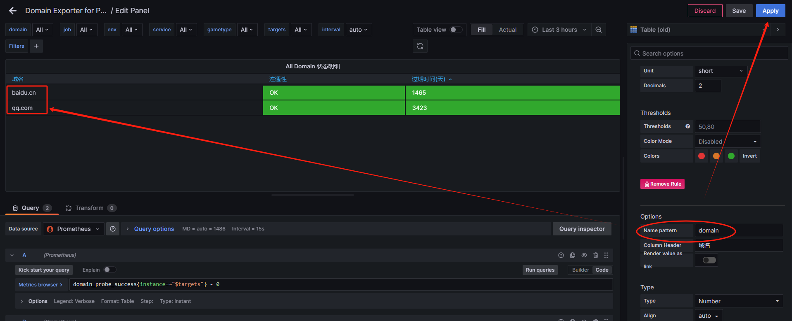

# 监控domain

## 1. domain_exporter安装
* 也是黑盒子监控，所以对于安装的位置没特殊要求

### 1.1 二进制方式


### 1.2 docker方式
```
docker run -d --restart=always --name domain_exporter -p 9222:9222 docker.1ms.run/caarlos0/domain_exporter
```




## 2. 配置Prometheus
* 添加Prometheus配置
```
cat >> /data/docker-prometheus/prometheus/prometheus.yml <<"EOF"
  - job_name: domain
    #scrape_interval: 1h
    scrape_interval: 15s
    metrics_path: /probe
    relabel_configs:
      - source_labels: [__address__]
        target_label: __param_target
      - target_label: __address__
        replacement: 192.168.50.134:9222 # domain_exporter address
    static_configs:
      - targets:
        - qq.com
        - baidu.cn
EOF
```

* 加载Prometheus
```
curl -X POST http://192.168.50.120:9090/-/reload
```

* 检查


## 3. 常见的指标
以`domain_`开头



* domain_expiry_days
* domain_probe_duration_seconds
* domain_probe_success



## 4. 触发器
* 添加告警配置
```
cat >> /data/docker-prometheus/prometheus/rules/domain.yml <<"EOF"
groups:
  - name: domain
    rules:
    - alert: 域名检测失败
      expr: domain_probe_success == 0
      for: 2h
      labels:
        severity: warning
      annotations:
        summary: '{{ $labels.instance }}'
        description: '{{ $labels.domain }}域名检测失败'
    - alert: 域名过期
      expr: domain_expiry_days < 30
      for: 2h
      labels:
        severity: warning
      annotations:
        summary: '{{ $labels.instance }}'
        description: '{{ $labels.domain }}将在30天后过期'
    - alert: 域名过期
      expr: domain_expiry_days < 5
      for: 2h
      labels:
        severity: page
      annotations:
        summary: '{{ $labels.instance }}'
        description: '{{ $labels.domain }}将在5天后过期'
EOF
```

* 校验Prometheus配置
```
docker exec -it prometheus promtool check config /etc/prometheus/prometheus.yml
```

* 加载Prometheus配置
```
curl -X POST http://192.168.50.120:9090/-/reload
```

## 5. 添加Grafana面板
ID: 14605
https://grafana.com/grafana/dashboards/14605-domain-exporter-for-prometheus/




### 5.1 dashboard不显示域名


=> 编辑Panel




