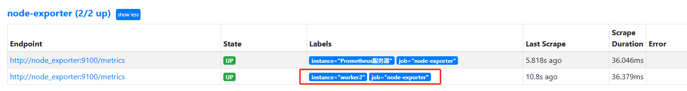
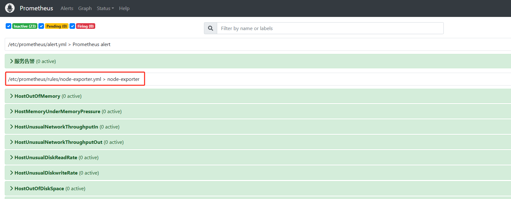
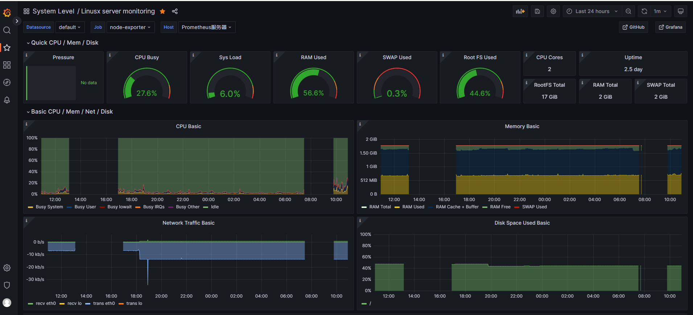

# 监控linux主机

## 1. 安装docker

## 2. 安装docker-compose
```
sudo curl -L "https://github.com/docker/compose/releases/download/$(curl -s https://api.github.com/repos/docker/compose/releases/latest | jq -r.tag_name)/docker-compose-$(uname -s)-$(uname -m)" -o /usr/local/bin/docker-compose
```

## 3. 安装node-exporter

### 3.1 二进制方式安装


### 3.2 docker方式安装
```
docker run -d --name node-exporter -v "/proc:/host/proc:ro" -v "/sys:/host/sys:ro" -v "/:/rootfs:ro" -p 9100:9100 docker.1ms.run/prom/node-exporter
```
* 将新的节点添加到Prometheus的配置中
```
  - job_name: 'node-exporter'
    scrape_interval: 15s
    static_configs:
    - targets: ['node_exporter:9100']
      labels:
        instance: Prometheus服务器
    # 新添加的node
    - targets: ['node_exporter:9100']
      labels:
        instance: worker2
```


## 4. 常用监控指标

### 4.1 cpu
* node_cpu_seconds_total
* node_load1/node_load5/node_load15，过去1min、5min、15min负载

### 4.2 memory
* node_memory_

### 4.3 disk
* node_disk_

### 4.4 filesystem
* node_filesystem_

### 4.5 network
* node_network_

## 5. 触发器设置
* node exporter触发器配置
```
# cat prometheus/rules/node-exporter.yml 
groups:
 - name: node-exporter
   rules:
   - alert: HostOutOfMemory
     expr: node_memory_MemAvailable_bytes / node_memory_MemTotal_bytes * 100 < 10
     for: 2m
     labels:
       severity: warning
     annotations:
       summary: "主机内存不足,实例:{{ $labels.instance }}"
       description: "内容可用率<10%，当前值：{{ $value }}"
   - alert: HostMemoryUnderMemoryPressure
     expr: rate(node_vmstat_pgmajfault[1m]) > 1000
     for: 2m
     labels:
       severity: warning
     annotations:
       summary: "内存压力不足,实例:{{ $labels.instance }}"
       description: "节点内存压力大。重大页面错误率高，当前值为：{{ $value }}"
   - alert: HostUnusualNetworkThroughputIn
     expr: sum by (instance) (rate(node_network_receive_bytes_total[2m])) / 1024 / 1024 > 100
     for: 5m
     labels:
       severity: warning
     annotations:
       summary: "异常流入网络吞吐量,实例:{{ $labels.instance }}"
       description: "网络流入流量 > 100 MB/s，当前值：{{ $value }}"
   - alert: HostUnusualNetworkThroughputOut
     expr: sum by (instance) (rate(node_network_transmit_bytes_total[2m])) / 1024 / 1024 > 100
     for: 5m
     labels:
       severity: warning
     annotations:
       summary: "异常流出网络吞吐量，实例:{{ $labels.instance }}"
       description: "网络流出流量 > 100 MB/s，当前值为：{{ $value }}"
   - alert: HostUnusualDiskReadRate
     expr: sum by (instance) (rate(node_disk_read_bytes_total[2m])) / 1024 / 1024 > 50
     for: 5m
     labels:
       severity: warning
     annotations:
       summary: "异常磁盘读取,实例:{{ $labels.instance }}"
       description: "磁盘读取> 50 MB/s，当前值：{{ $value }}"
   - alert: HostUnusualDiskwriteRate
     expr: sum by (instance) (rate(node_disk_written_bytes_total[2m])) / 1024 / 1024 > 50
     for: 2m
     labels:
       severity: warning
     annotations:
       summary: "异常磁盘写入,实例:{{ $labels.instance }}"
       description: "磁盘写入> 50 MB/s，当前值：{{ $value }}"
       
   - alert: HostOutOfDiskSpace
     expr: (node_filesystem_avail_bytes * 100) / node_filesystem_size_bytes < 10 and ON (instance, device, mountpoint) node_filesystem_readonly == 0
     for: 2m
     labels:
       severity: warning
     annotations:
       summary: "磁盘空间不足告警,实例:{{ $labels.instance }}"
       description: "剩余磁盘空间< 10%，当前值：{{ $value }}"
   - alert: HostDiskwillFillIn24Hours
     expr: (node_filesystem_avail_bytes * 100) / node_filesystem_size_bytes < 10 and ON (instance, device, mountpoint) predict_linear(node_filesystem_avail_bytes{fstype!~"tmpfs"}[1h], 24 * 3600) < 0 and ON (instance, device, mountpoint) node_filesystem_readonly == 0
     for: 2m
     labels:
       severity: warning
     annotations:
       summary: "磁盘空间将在24小时内耗尽,实例:{{ $labels.instance }}"
       description: "以当前写入速率预计磁盘空间将在 24 小时内耗尽，当前值：{{ $value }}"
   - alert: HostOutOfInodes
     expr: node_filesystem_files_free{mountpoint ="/"} / node_filesystem_files{mountpoint="/"} * 100 < 10 and ON (instance, device, mountpoint) node_filesystem_readonly{mountpoint="/"} == 0
     for: 2m
     labels:
       severity: warning
     annotations:
     
       summary: "磁盘Inodes不足,实例:{{ $labels.instance }}"
       description: "剩余磁盘 inodes < 10%，当前值：{{ $value }}"
   - alert: HostUnusualDiskReadLatency
     expr: rate(node_disk_read_time_seconds_total[1m]) / rate(node_disk_reads_completed_total[1m]) > 0.1 and rate(node_disk_reads_completed_total[1m]) > 0
     for: 2m
     labels:
       severity: warning
     annotations:
       summary: "异常磁盘读取延迟,实例:{{ $labels.instance }}"
       description: "磁盘读取延迟 > 100ms，当前值：{{ $value }}"
   - alert: HostUnusualDiskwriteLatency
     expr: rate(node_disk_write_time_seconds_total[1m]) / rate(node_disk_writes_completed_total[1m]) > 0.1 and rate(node_disk_writes_completed_total[1m]) > 0
     for: 2m
     labels:
       severity: warning
     annotations:
       summary: "异常磁盘写入延迟,实例:{{ $labels.instance }}"
       description: "磁盘写入延迟 > 100ms，当前值：{{ $value }}"
   - alert: high_load
     expr: node_load1 > 4
     for: 2m
     labels:
       severity: page
     annotations:
       summary: "CPU1分钟负载过高,实例:{{ $labels.instance }}"
       description: "CPU1分钟负载>4，已经持续2分钟。当前值为：{{ $value }}"
   - alert: HostcpuIsUnderUtilized
     expr: 100 - (avg by(instance) (rate(node_cpu_seconds_total{mode="idle"}[2m])) * 100) > 80
     for: 1m
     labels:
       severity: warning
     annotations:
       summary: "cpu负载高,实例:{{ $labels.instance }}"
       description: "cpu负载> 80%，当前值：{{ $value }}"
   - alert: HostCpuStealNoisyNeighbor
     expr: avg by(instance) (rate(node_cpu_seconds_total{mode="steal"}[5m])) * 100 > 10
     for: 0m
     labels:
       severity: warning
     annotations:
       summary: "CPU窃取率异常,实例:{{ $labels.instance }}"
       description: "CPU 窃取率 > 10%。嘈杂的邻居正在扼杀 VM 性能，或者 Spot 实例可能失去信用，当前值：{{ $value }}"
   - alert: HostSwapIsFillingUp
     expr: (1 - (node_memory_SwapFree_bytes / node_memory_SwapTotal_bytes)) * 100 > 80
     for: 2m
     labels:
       severity: warning
     annotations:
       summary: "磁盘swap空间使用率异常,实例:{{ $labels.instance }}"
       description: "磁盘swap空间使用率>80%"
   - alert: HostNetworkReceiveErrors
     expr: rate(node_network_receive_errs_total[2m]) / rate(node_network_receive_packets_total[2m]) > 0.01
     for: 2m
     labels:
       severity: warning
     annotations:
       summary: "异常网络接收错误,实例:{{ $labels.instance }}"
       description: "网卡{{ $labels.device }}在过去2分钟接收{{ $value }}个错误"
   - alert: HostNetworkTransmitErrors
     expr: rate(node_network_transmit_errs_total[2m]) / rate(node_network_transmit_packets_total[2m]) > 0.01
     for: 2m
     labels:
       severity: warning
     annotations:
       summary: "异常网络传输错误,实例:{{ $labels.instance }}"
       description: "网卡{{ $labels.device }}在过去2分钟传输{{ $value }}个错误"
   - alert: HostNetworkInterfaceSaturated
     expr: (rate(node_network_receive_bytes_total{device!~"^tap.*"}[1m]) + rate(node_network_transmit_bytes_total{device!~"^tap.*"}[1m])) / node_network_speed_bytes{device!~"^tap.*"} > 0.8 < 1000
     for: 1m
     labels:
       severity: warning
     annotations:
       summary: "异常网络接口饱和,实例:{{ $labels.instance }}"
       description: "网卡{{ $labels.device }}正在超载，当前值{{ $value }}"
   - alert: HostConntrackLimit
     expr: node_nf_conntrack_entries / node_nf_conntrack_entries_limit > 0.8
     for: 5m
     labels:
       severity: warning
     annotations:
       summary: "异常连接数,实例:{{ $labels.instance }}"
       description: "连接数过大，当前连接数：{{ $value }}"
   - alert: HostClockSkew
     expr: (node_timex_offset_seconds > 0.05 and deriv(node_timex_offset_seconds[5m]) >= 0) or (node_timex_offset_seconds < -0.05 and deriv(node_timex_offset_seconds[5m]) <= 0)
     for: 2m
     labels:
       severity: warning
     annotations:
       summary: "异常时钟偏差,实例:{{ $labels.instance }}"
       description: "检测到时钟偏差，时钟不同步。值为：{{ $value }}"
   - alert: HostClockNotSynchronising
     expr: min_over_time(node_timex_sync_status[1m]) == 0 and node_timex_maxerror_seconds >= 16
     for: 2m
     labels:
       severity: warning
     annotations:
       summary: "时钟不同步,实例:{{ $labels.instance }}"
       description: "时钟不同步"
```
* Prometheus配置文件中添加node exporter触发器配置文件
```
# 报警(触发器)配置
rule_files:
  - "alert.yml"
  - "rules/pushgateway.yml"
  - "rules/node-exporter.yml"
```

* 检测触发器的配置文件是否有问题
```
docker exec -it prometheus promtool check config /etc/prometheus/prometheus.yml
```

* 重新加载配置
```
curl -X POST http://192.168.50.120:9090/-/reload
```


## 6. 添加Grafana面板
id: 1860


