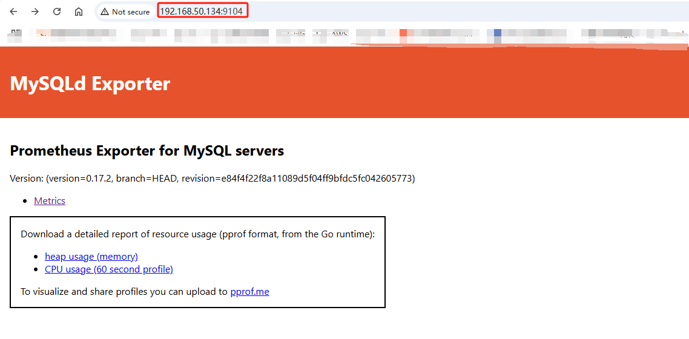
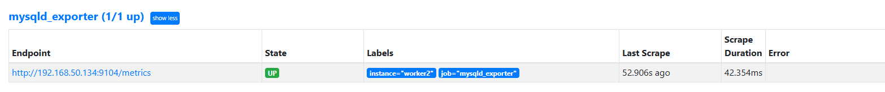
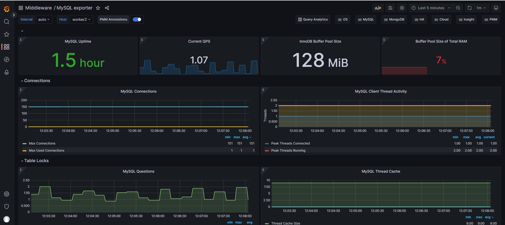
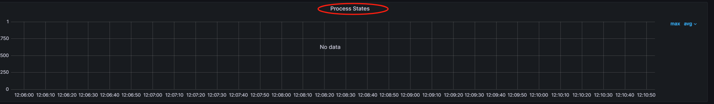
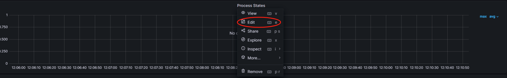
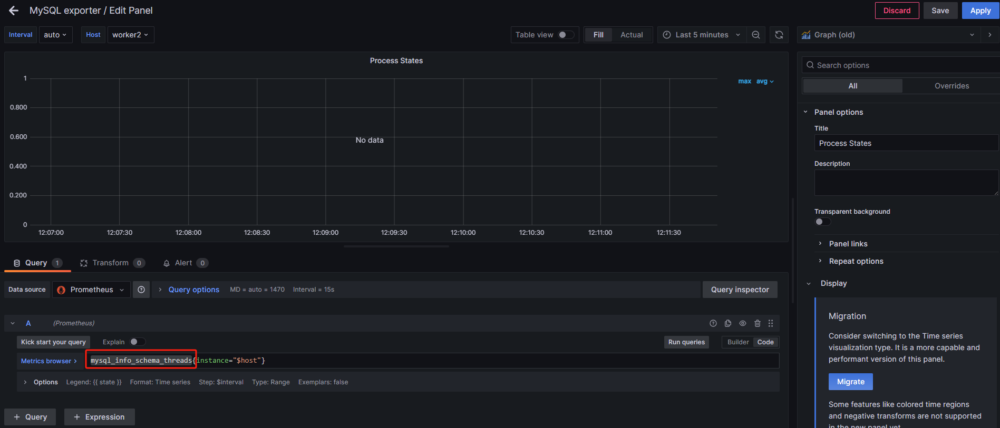
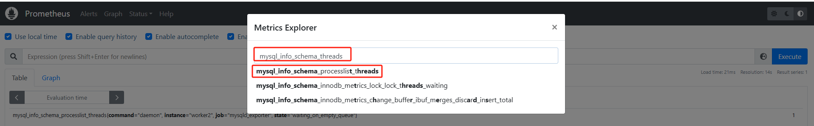
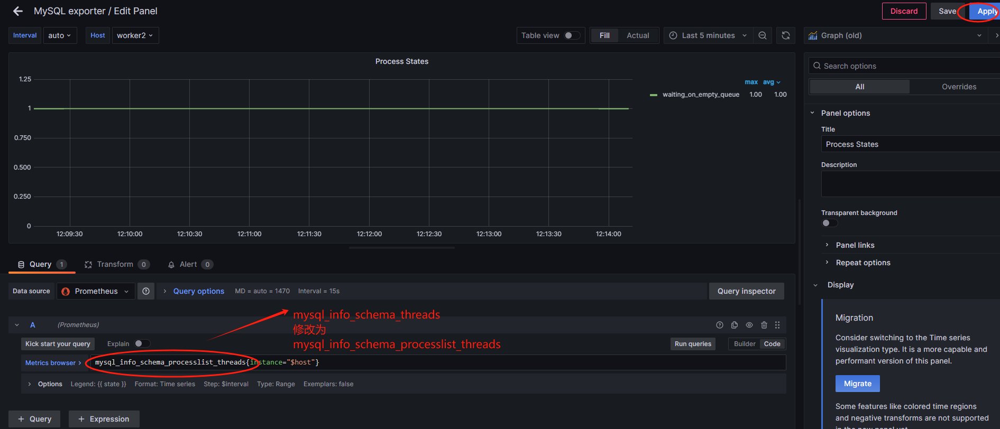
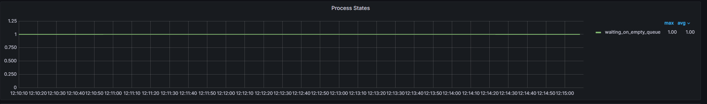

# mysql monitor

## 1. 安装mysql

### 1.1 创建数据目录
```
mkdir -p /data/mysql
cd /data/mysql
```

### 1.2 docker-compose安装mysql
* 通过cat创建docker-compose.yaml文件
```
cat > docker-compose.yaml <<"EOF"
services:
  db:
    image: mysql:8.0
    restart: always
    container_name: mysql
    environment:
      TZ: Asia/Shanghai
      LANG: en_US.UTF-8
      MYSQL_ROOT_PASSWORD: 123456
    command:
      --default-authentication-plugin=mysql_native_password
      --character-set-server=utf8mb4
      --collation-server=utf8mb4_general_ci
      --lower_case_table_names=1
      --performance_schema=1
      --sql-mode=""
      --skip-log-bin
    volumes:
      #- /data/mysql/conf/etc/mysql/conf.d #数据文件挂载
      - /data/mysql/data:/var/lib/mysql #数据文件挂载
    ports:
      - 3306:3306
EOF
``` 
* 运行
```
docker-compose up -d
```

### 1.3 通过docker方式安装(使用)
```
docker run -d \
--restart=always \
--name mysql \
-e TZ=Asia/Shanghai \
-e LANG=en_US.UTF-8 \
-e MYSQL_ROOT_PASSWORD=123456 \
-v /data/mysql/data:/var/lib/mysql \
-p 3306:3306 \
docker.1ms.run/mysql:8.0 \
--default-authentication-plugin=mysql_native_password \
--character-set-server=utf8mb4 \
--collation-server=utf8mb4_general_ci \
--lower_case_table_names=1 \
--performance_schema=1 \
--sql-mode="" \
--skip-log-bin
```

## 2. mysqld_exporter
创建用户
* 登陆mysql
```
docker exec -it mysql mysql -uroot -p
```
输入密码: 123456
* 创建用户
```
CREATE USER 'exporter'@'%' IDENTIFIED BY 'password' WITH MAX_USER_CONNECTIONS 3;
GRANT PROCESS, REPLICATION CLIENT, SELECT ON *.* TO 'exporter'@'%';
```
* 验证
```
docker exec -it mysql mysql -uexporter -p
```
输入密码进行验证
```
root@worker2:~# docker exec -it mysql mysql -uexporter -p
Enter password: 
Welcome to the MySQL monitor.  Commands end with ; or \g.
Your MySQL connection id is 9
Server version: 8.0.41 MySQL Community Server - GPL

Copyright (c) 2000, 2025, Oracle and/or its affiliates.

Oracle is a registered trademark of Oracle Corporation and/or its
affiliates. Other names may be trademarks of their respective
owners.

Type 'help;' or '\h' for help. Type '\c' to clear the current input statement.

mysql> show databases;
+--------------------+
| Database           |
+--------------------+
| information_schema |
| mysql              |
| performance_schema |
| sys                |
+--------------------+
4 rows in set (0.00 sec)

```

### 2.1 二进制方式安装
https://www.prometheus.wang/exporter/use-promethues-monitor-mysql.html

### 2.2 docker方式安装
* 配置用户账号信息
```
# mkdir -p /data/mysqld_exporter
# cd /data/mysqld_exporter/
# cat my.cnf
[client]
host=192.168.50.134
user=exporter
password=password
```
* 运行mysqld_exporter容器
```
docker run -d \
--restart=always \
--name mysqld-exporter \
--net=host \
-v /data/mysqld_exporter/my.cnf:/etc/mysql/my.cnf:ro \
-p 9104:9104 \
docker.1ms.run/prom/mysqld-exporter \
--config.my-cnf=/etc/mysql/my.cnf \
--collect.info_schema.processlist \
--collect.info_schema.innodb_metrics \
--collect.info_schema.tablestats \
--collect.info_schema.tables \
--collect.info_schema.userstats \
--collect.engine_innodb_status
```


* 添加到Prometheus
```
  - job_name: 'mysqld_exporter'
    static_configs:
      - targets: ['192.168.50.134:9104']
        labels:
          instance: worker2
```
* 重载Prometheus配置
```
curl -X POST http://192.168.50.120:9090/-/reload
```


## 3. 常见的指标
* mysql_up	服务器是否在线
* mysql_global_status_uptime	运行时长，单位 s
* delta(mysql_global_status_bytes_received[1m])	网络接收的 bytes
* delta(mysql_global_status_bytes_sent[1m])	网络发送的 bytes
* mysql_global_status_threads_connected	当前的客户端连接数
* mysql_global_variables_max_connections	允许的最大连接数
* mysql_global_status_threads_running	正在执行命令的客户端连接数，即非 sleep 状态
* delta(mysql_global_status_aborted_connects[1m])	客户端建立连接失败的连接数，比如登录失败
* delta(mysql_global_status_aborted_clients[1m])	客户端连接之后，未正常关闭的连接数
* delta(mysql_global_status_commands_total{command="xx"}[1m]) > 0	每分钟各种命令的次数
* delta(mysql_global_status_handlers_total{handler="xx"}[1m]) > 0	每分钟各种操作的次数
* delta(mysql_global_status_handlers_total{handler="commit"}[1m]) > 0	每分钟 commit 的次数
* delta(mysql_global_status_table_locks_immediate[1m])	请求获取锁，且立即获得的请求数
* delta(mysql_global_status_table_locks_waited[1m])	请求获取锁，但需要等待的请求数。该值越少越好
* delta(mysql_global_status_queries[1m])	每分钟的查询数
* delta(mysql_global_status_slow_queries[1m])	慢查询。如果未启用慢查询日志，则为 0
* mysql_global_status_innodb_page_size	innodb 数据页的大小，单位 bytes
* mysql_global_variables_innodb_buffer_pool_size	innodb_buffer_pool 的限制体积
* mysql_global_status_buffer_pool_pages{state="data"}	包含数据的数据页，包括洁页、脏页
* mysql_global_status_buffer_pool_dirty_pages	脏页数


## 4. Prometheus触发器设置
* 配置Prometheus告警规则
```
cat >> /data/docker-prometheus/prometheus/rules/mysqld-exporter.yml <<"EOF"
groups:
- name: MySQL
  rules:
  - alert: MysqlDown
    expr: mysql_up == 0
    for: 30s
    labels:
      severity: critical
    annotations:
      summary: "MySQL Down,实例:{{ $labels.instance }}"
      description: "MySQL_exporter连不上MySQL了，当前状态为：{{ $value }}"
  - alert: MysqlTooManyConnections
    expr: max_over_time(mysql_global_status_threads_connected[1m]) / mysql_global_variables_max_connections * 100 > 80
    for: 2m
    labels:
      severity: warning
    annotations:
      summary: "Mysql连接数过多告警,实例:{{ $labels.instance }}"
      description: "MySQL连接数>80%，当前值：{{ $value }}"
  - alert: MysqlHighThreadsRunning
    expr: max_over_time(mysql_global_status_threads_running[1m]) > 20
    for: 2m
    labels:
      severity: warning
    annotations:
      summary: "Mysql运行的线程过多,实例:{{ $labels.instance }}"
      description: "Mysql运行的线程 > 20，当前运行的线程：{{ $value }}" 
  - alert: MysqlSlowQueries
    expr: increase(mysql_global_status_slow_queries[2m]) > 0
    for: 2m
    labels:
      severity: warning
    annotations:
      summary: "Mysql慢日志告警,实例:{{ $labels.instance }}"
      description: "MySQL在过去2分钟有新的{{ $value }}条慢查询"
  #MySQL innodb 日志写入停滞
  - alert: MysqlInnodbLogWaits
    expr: rate(mysql_global_status_innodb_log_waits[15m]) > 10
    for: 0m
    labels:
      severity: warning
    annotations:
      summary: "MySQL innodb日志等待,实例:{{ $labels.instance }}"
      description: "MySQL innodb日志写入停滞，当前值：{{ $value }}" 
  - alert: MysqlRestarted
    expr: mysql_global_status_uptime < 60
    for: 0m
    labels:
      severity: info
    annotations:
      summary: "MySQL 重启,实例:{{ $labels.instance }}"
      description: "不到一分钟前，MySQL重启过"
EOF
```

* 校验Prometheus配置
```
docker exec -it prometheus promtool check config /etc/prometheus/prometheus.yml
```

* 加载Prometheus配置
```
curl -X POST http://192.168.50.120:9090/-/reload
```

## 5. 添加Grafana面板
https://grafana.com/grafana/dashboards/7362

ID：9625， 表的监控

https://github.com/percona/grafana - dashboards/tree/main/dashboards/MySQL

* 7362



### 5.1 面板上有些指标没有说数据



edit这个监控指标


到Prometheus上查询指标是否有数据，一般是指标名称不一致





指标名称`mysql_info_schema_threads`需要修改为`mysql_info_schema_processlist_threads`



此时即可查询到数据

