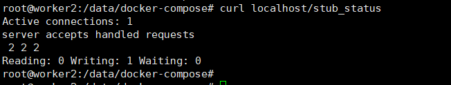
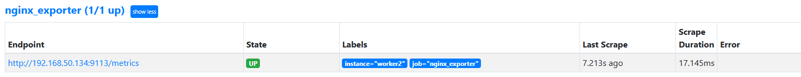
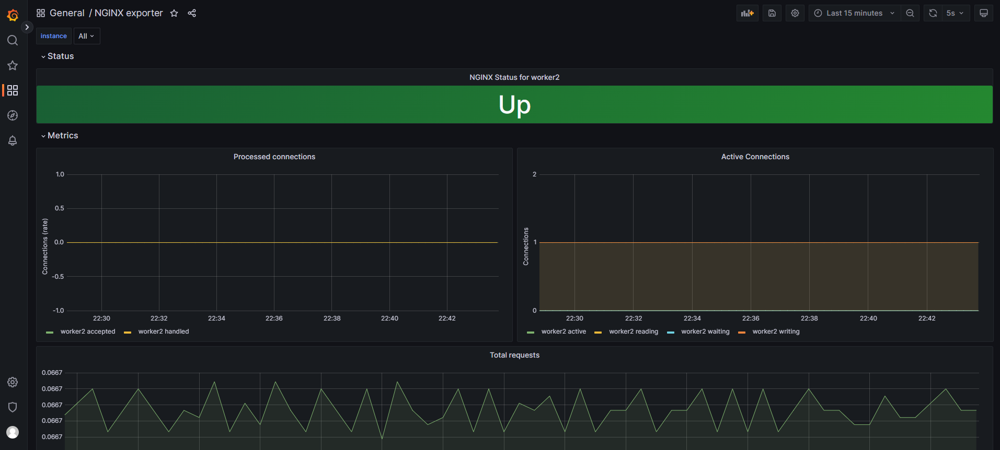

# 监控nginx

## 1. 创建nginx目录
```
#切换到root用户
sudo -i
mkdir /data/nginx/conf.d -p
cd /data/nginx/conf.d
```
在/data/nginx/conf.d目录里面新增加nginx的配置文件
```
cat >>server.conf<< "EOF"
server {
    listen       80;
    server_name  localhost;

    location / {
        root   /usr/share/nginx/html;
        index  index.html index.htm;
    }

    error_page   500 502 503 504  /50x.html;
    location = /50x.html {
        root   /usr/share/nginx/html;
    }
}
EOF
```
## 2. 使用docker-compose安装rabbitmq、nginx、mongo、redis 
* 方便后续对rabbitmq，nginx，mongo，redis进行监控

创建存放docker-compose相关文件的目录并进入该目录
```
mkdir /data/docker-compose -p
cd /data/docker-compose
```

通过cat创建docker-compose.yaml文件
```
cat > docker-compose.yaml <<"EOF"
services:
  redis:
    image: docker.1ms.run/redis:5
    container_name: redis
    command: redis-server --requirepass 123456 --maxmemory 512mb
    restart: always
    volumes:
      - /data/redis/data:/data
    ports:
      - 6379:6379
  nginx:
    image: docker.1ms.run/nginx:1.21.6
    container_name: nginx
    restart: always
    volumes:
      - /data/nginx/conf.d:/etc/nginx/conf.d
      - /data/nginx/html:/usr/share/nginx/html
      - /data/nginx/log:/var/log/nginx
    ports:
      - 80:80
  rabbitmq:
    image: docker.1ms.run/rabbitmq:3.7.15-management
    container_name: rabbitmq
    restart: always
    volumes:
      - /data/rabbitmq/data:/var/lib/rabbitmq
      - /data/rabbitmq/log:/var/log/rabbitmq
    ports:
      - 5672:5672
      - 15672:15672
  mongo:
    image: docker.1ms.run/mongo:4.2.5
    container_name: mongo
    restart: always
    volumes:
      - /data/mongo/db:/data/db
    ports:
      - 27017:27017
    command: [--auth]
    environment:
      MONGO_INITDB_ROOT_USERNAME: root
      MONGO_INITDB_ROOT_PASSWORD: 123456
EOF
```

运行服务
```
docker-compose up -d
```

检查运行的容器
```
# docker ps
CONTAINER ID   IMAGE                                       COMMAND                  CREATED          STATUS          PORTS                                                                                                                                NAMES
73e4509656f1   docker.1ms.run/rabbitmq:3.7.15-management   "docker-entrypoint.s…"   27 minutes ago   Up 27 minutes   4369/tcp, 5671/tcp, 0.0.0.0:5672->5672/tcp, :::5672->5672/tcp, 15671/tcp, 25672/tcp, 0.0.0.0:15672->15672/tcp, :::15672->15672/tcp   rabbitmq
10a1ec32f493   docker.1ms.run/redis:5                      "docker-entrypoint.s…"   27 minutes ago   Up 27 minutes   0.0.0.0:6379->6379/tcp, :::6379->6379/tcp                                                                                            redis
e42d1b443d49   docker.1ms.run/nginx:1.21.6                 "/docker-entrypoint.…"   27 minutes ago   Up 27 minutes   0.0.0.0:80->80/tcp, :::80->80/tcp                                                                                                    nginx
5716b8745f30   docker.1ms.run/mongo:4.2.5                  "docker-entrypoint.s…"   27 minutes ago   Up 27 minutes   0.0.0.0:27017->27017/tcp, :::27017->27017/tcp                                                                                        mongo
210c3141e10d   docker.1ms.run/prom/node-exporter           "/bin/node_exporter"     2 hours ago      Up 2 hours      0.0.0.0:9100->9100/tcp, :::9100->9100/tcp                                                                                            node-exporter
```

## 3. 监控nginx
### 3.1 nginx开启stub_status
* 监控nginx需要with-http_stub_status_module

检查是否安装有with-http_stub_status_module模块
```
# docker exec -it nginx nginx -V 2>&1 | grep -o with-http_stub_status_module
with-http_stub_status_module
```

nginx开启stub_status配置
```
server {
   ...
    location /stub_status {
        stub_status on;
        access_log off;
        #allow nginx_export的ip;
        allow 0.0.0.0/0;
        deny all;
    }
   ...
}
```

完整配置如下
```
server {
    listen       80;
    server_name  localhost;

    location /stub_status {
        stub_status on;
        access_log off;
        #allow nginx_export的ip;
        allow 0.0.0.0/0;
        deny all;
    }

    location / {
        root   /usr/share/nginx/html;
        index  index.html index.htm;
    }

    error_page   500 502 503 504  /50x.html;
    location = /50x.html {
        root   /usr/share/nginx/html;
    }
}
```

加载nginx配置
```
docker exec -it nginx nginx -s reload
```

访问stub_status接口
```
curl localhost/stub_status
```

* Active connections -- 活动连接数
* accepts -- 接收请求数
* handled -- 成功处理请求数
* requests -- 总请求数
* reding -- 正在进行读操作的请求数
* writing -- 正在进行写操作的请求数
* waiting -- 正在等待的请求数


## 4. 安装nginx-exporter

### 4.1 二进制安装


### 4.2 docker安装
```
cat >> /data/nginx/docker-compose.yml <<EOF
services:
  nginx_exporter:
    image: docker.1ms.run/nginx/nginx-prometheus-exporter:0.11
    container_name: nginx_exporter
    hostname: nginx_exporter
    command:
      - '--nginx.scrape-uri=http://192.168.50.134/stub_status'
    restart: always
    ports:
      - "9113:9113"
EOF
```
* nginx.scrape-uri -- nginx的stub_status接口地址
* 安装nginx-exporter会暴漏http://${ip}:${port}/metrics的http服务

## 5. 配置Prometheus

* 配置Prometheus去拉取nginx的指标
```
cat >> /data/docker-prometheus/prometheus/prometheus.yml << "EOF"
  - job_name: 'nginx_exporter'
    static_configs:
      - targets: ['192.168.50.134:9113']
        labels:
          instance: worker2
EOF
```

* 加载Prometheus配置
```
curl -X POST http://192.168.50.120:9090/-/reload
```

* 检查



## 6. 常见的指标

* nginx_connections_accepted  接收请求数
* nginx_connections_active    活动连接数
* nginx_connections_handled   成功处理请求数
* nginx_connections_reding    正在进行读操作的请求数
* nginx_connections_waiting   正在等待的请求数
* nginx_connections_writing   正在进行写操作的请求数
* nginx_connections_requests  总请求数


## 7. 添加触发器
* 配置Prometheus告警规则
```
cat >>/data/docker-prometheus/prometheus/rules/nginx-exporter.yml <<"EOF"
groups:
 - name: nginx
   rules:
   # 对任何实例超过30秒无法联系的情况发出警报
   - alert: NginxDown
     expr: nginx_up == 0
     for: 30s
     labels:
       severity: critical
     annotations:
       summary: "nginx异常,实例:{{ $labels.instance }}"
       description: "{{ $labels.job }} nginx已关闭"
EOF
```
* 更改/data/docker-prometheus/prometheus/prometheus.yml
```
# 报警(触发器)配置
rule_files:
  - "alert.yml"
  - "rules/pushgateway.yml"
  - "rules/node-exporter.yml"
  - "rules/*.yml"
```
* 加载Prometheus配置
```
curl -X POST http://192.168.50.120:9090/-/reload
```

## 8. 添加Grafana面板
id: 13577



