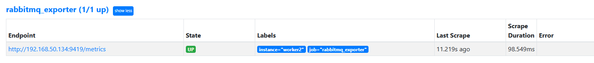
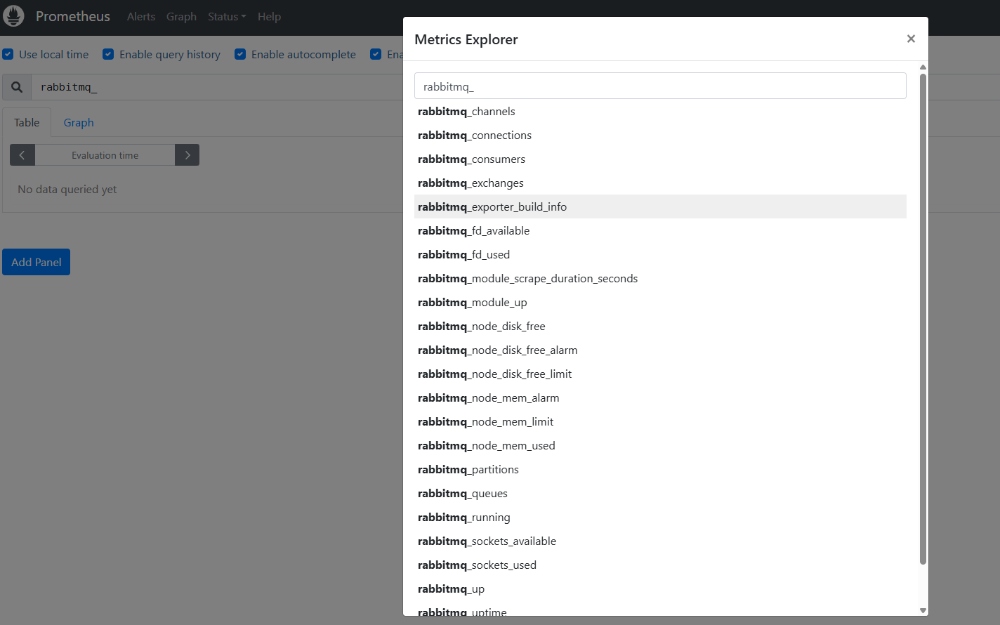
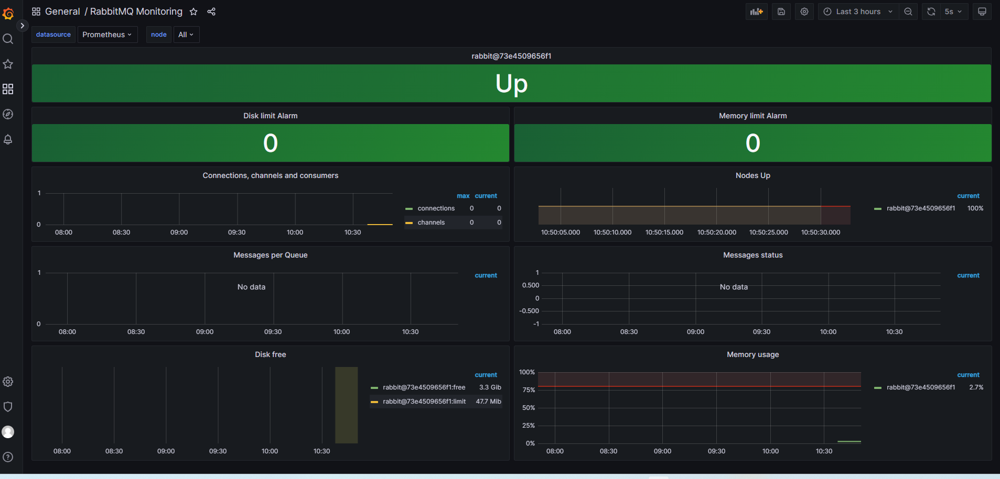

# rabbitmq monitor

rabbitmq已在nginx部分通过docker-compose进行了安装

## 1. rabbitmq exporter

### 1.1 二进制安装


### 1.2 docker安装
```
docker run -d -p 9419:9419 --name rabbitmq_exporter -e RABBIT_URL=http://192.168.50.134:15672 -e RABBIT_USER=guest -e RABBIT_PASSWORD=guest docker.1ms.run/kbudde/rabbitmq-exporter
```

参数解释
Environment variable	    default	                description
RABBIT_URL	            http://127.0.0.1:15672	rabbitMQ 管理插件的 url（必须以 http (s):// 开头）
RABBIT_USER	                guest	            rabbitMQ 管理插件的用户名。
RABBIT_PASSWORD	            guest	            rabbitMQ 管理插件的密码。
OUTPUT_FORMAT	            JSON	            输出格式
PUBLISH_PORT	            9419	            运行端口 (监听端口)


## 2. 配置Prometheus
* 配置Prometheus拉取指标
```
cat >> /data/docker-prometheus/prometheus/prometheus.yml << "EOF"
  - job_name: 'rabbitmq_exporter'
    static_configs:
      - targets: ['192.168.50.134:9419']
        labels:
          instance: worker2
EOF
```

* 加载Prometheus配置
```
curl -X POST http://192.168.50.120:9090/-/reload
```

* 检查



## 3. 常见的指标
* rabbitmq_queue_messages_unacknowledged_global 队列中有未确认的消息总数（未被消费的消息）
* rabbitmq_node_disk_free_limit 使用磁盘大小
* rabbitmq_node_disk_free 磁盘总大小
* rabbitmq_node_mem_used 使用内存大小
* rabbitmq_node_mem_limit 内存总大小
* rabbitmq_sockets_used 使用 sockets 的数量
* rabbitmq_sockets_available 可用的 sockets 总数
* rabbitmq_fd_used 使用文件描述符的数量
* rabbitmq_fd_available 可用的文件描述符总数



## 4. 添加触发器
* 配置Prometheus告警规则
```
cat > /data/docker-prometheus/prometheus/rules/rabbitmq-exporter.yml <<"EOF"
groups:
- name: rabbitmq
  rules:
  - alert: RabbitMQDown
    expr: rabbitmq_up != 1
    labels:
      severity: High
    annotations:
      summary: "Rabbitmq Down,实例:{{ $labels.instance }}"
      description: "Rabbitmq_exporter连不上RabbitMQ！！！"
  - alert: RabbitMQ有未确认消息
    expr: rabbitmq_queue_messages_unacknowledged_global > 0
    for: 1m
    labels:
      severity: critical
    annotations:
      summary: "RabbitMQ有未确认消息,实例:{{ $labels.instance }}"
      description: 'RabbitMQ未确认消息>0,当前值为：{{ $value }}'
  - alert: RabbitMQ可用磁盘空间不足告警
    expr: rabbitmq_node_disk_free_alarm != 0
    #expr: rabbitmq_node_disk_free_limit / rabbitmq_node_disk_free *100 > 90
    for: 0m
    labels:
      severity: critical
    annotations: 
      summary: "RabbitMQ可用磁盘空间不足,实例:{{ $labels.instance }}"
      description: "RabbitMQ可用磁盘空间不足，请检查"
  - alert: RabbitMQ可用内存不足告警
    expr: rabbitmq_node_mem_alarm != 0
    #expr: rabbitmq_node_mem_used / rabbitmq_node_mem_limit * 100 > 90
    for: 0m
    labels:
      severity: critical
    annotations:
      summary: "RabbitMQ可用内存不足,实例:{{ $labels.instance }}"
      description: "RabbitMQ可用内存不足，请检查"
  - alert: RabbitMQ_socket连接数使用过高告警
    expr: rabbitmq_sockets_used / rabbitmq_sockets_available * 100 > 60
    for: 0m
    labels:
      severity: critical
    annotations:
      summary: "RabbitMQ_socket连接数使用过高,实例:{{ $labels.instance }}"
      description: 'RabbitMQ_sockets使用>60%,当前值为：{{ $value }}'
  - alert: RabbitMQ文件描述符使用过高告警
    expr: rabbitmq_fd_used / rabbitmq_fd_available * 100 > 60
    for: 0m
    labels:
      severity: critical
    annotations:
      summary: "RabbitMQ文件描述符使用过高,实例:{{ $labels.instance }}"
      description: 'RabbitMQ文件描述符使用>60%,当前值为：{{ $value }}'
EOF
```

* 校验Prometheus配置
```
docker exec -it prometheus promtool check config /etc/prometheus/prometheus.yml
```

* 加载Prometheus配置
```
curl -X POST http://192.168.50.120:9090/-/reload
```

## 5. 添加Grafana面板
id: 4279


