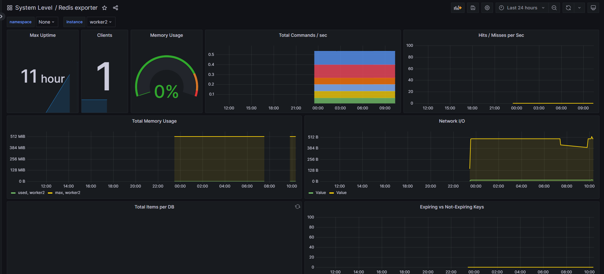

# redis monitor

redis已在nginx部分通过docker-compose进行了安装

## 1. Redis exporter

### 1.1 二进制安装


### 1.2 docker安装
```
docker run -d --name redis_exporter -p 9121:9121 docker.1ms.run/oliver006/redis_exporter --redis.addr redis://192.168.50.134:6379 --redis.password '123456'
```

## 2. 配置Prometheus
* 配置Prometheus拉取指标
```
cat >> /data/docker-prometheus/prometheus/prometheus.yml << "EOF"
  - job_name: 'redis_exporter'
    static_configs:
      - targets: ['192.168.50.134:9121']
        labels:
          instance: worker2
EOF
```

* 加载Prometheus配置
```
curl -X POST http://192.168.50.120:9090/-/reload
```

* 检查


## 3. 常见的指标
* redis_up                                # 服务器是否在线
* redis_uptime_inseconds                  # 运行时长，单位 s
* rate(redis_cpu_sys_seconds_total[1m]) + rate(redis_cpu_user_seconds_total[1m])  # 占用 CPU 核数
* redis_memory_used_bytes                 # 占用内存量
* redis_memory_max_bytes                  # 限制的最大内存，如果没限制则为 0
* delta(redis_net_input_bytes_total[1m])  # 网络接收的 bytes
* delta(redis_net_output_bytes_total[1m]) # 网络发送的 bytes

* redis_connected_clients                 # 客户端连接数
* redis_connected_clients / redis_config_maxclients  # 连接数使用率
* redis_rejected_connections_total        # 拒绝的客户端连接数
* redis_connected_slaves                  # slave 连接数 


## 4. 添加触发器
* 配置Prometheus告警规则
```
cat > /data/docker-prometheus/prometheus/rules/redis-exporter.yml <<"EOF"
groups:
- name: redis
  rules:
  - alert: RedisDown
    expr: redis_up == 0
    for: 0m
    labels:
      severity: critical
    annotations:
      summary: 'Redis Down,实例:{{ $labels.instance }}'
      description: "Redis实例 is down"
  - alert: RedisMissingBackup
    expr: time() - redis_rdb_last_save_timestamp_seconds > 60 * 60 * 24
    for: 0m
    labels:
      severity: critical
    annotations:
      summary: "Redis备份丢失,实例:{{ $labels.instance }}"
      description: "Redis 24小时未备份"
  - alert: RedisOutOfConfiguredMaxmemory
    expr: redis_memory_used_bytes / redis_memory_max_bytes * 100 > 90
    for: 2m
    labels:
      severity: warning
    annotations:
      summary: "Redis超出配置的最大内存,实例:{{ $labels.instance }}"
      description: "Redis内存使用超过配置最大内存的90%"
  - alert: RedisTooManyConnections
    expr: redis_connected_clients > 100
    for: 2m
    labels:
      severity: warning
    annotations:
      summary: "Redis连接数过多,实例:{{ $labels.instance }}"
      description: "Redis当前连接数为：{{ $value }}"
  - alert: RedisNotEnoughConnections
    expr: redis_connected_clients < 1
    for: 2m
    labels:
      severity: warning
    annotations:
      summary: "Redis没有足够的连接,实例:{{ $labels.instance }}"
      description: "Redis当前连接数为：{{ $value }}"
  - alert: RedisRejectedConnections
    expr: increase(redis_rejected_connections_total[1m]) > 0
    for: 0m
    labels:
      severity: critical
    annotations:
      summary: "Redis有拒绝连接,实例:{{ $labels.instance }}"
      description: "与Redis 的某些连接被拒绝{{ $value }}"
EOF
```
* 校验Prometheus配置
```
# docker exec -it prometheus promtool check config /etc/prometheus/prometheus.yml
Checking /etc/prometheus/prometheus.yml
  SUCCESS: 7 rule files found
 SUCCESS: /etc/prometheus/prometheus.yml is valid prometheus config file syntax

Checking /etc/prometheus/alert.yml
  SUCCESS: 1 rules found

Checking /etc/prometheus/rules/pushgateway.yml
  SUCCESS: 1 rules found

Checking /etc/prometheus/rules/node-exporter.yml
  SUCCESS: 21 rules found

Checking /etc/prometheus/rules/nginx-exporter.yml
  SUCCESS: 1 rules found

Checking /etc/prometheus/rules/node-exporter.yml
  SUCCESS: 21 rules found

Checking /etc/prometheus/rules/pushgateway.yml
  SUCCESS: 1 rules found

Checking /etc/prometheus/rules/redis-exporter.yml
  SUCCESS: 6 rules found

```

* 加载Prometheus配置
```
curl -X POST http://192.168.50.120:9090/-/reload
```

## 5. 添加Grafana面板
id: 763



