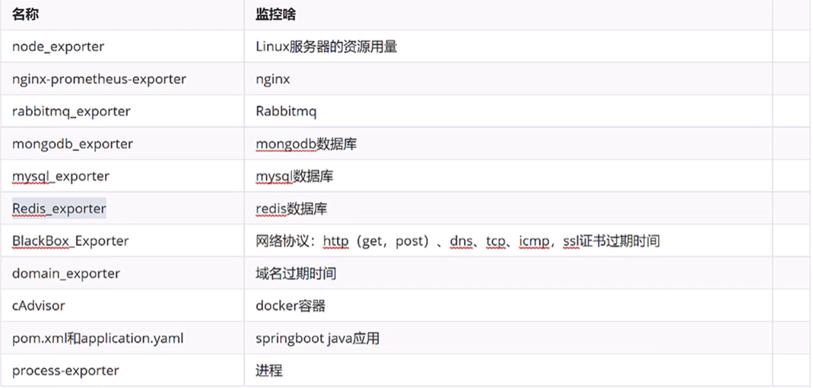

# 监控总结

## 1. 监控流程总结
* 需要在被监控的服务器上安装xx_exporter来收集数据
* 添加Prometheus配置，去收集（xx_exporter）提供的监控样本数据
* 配置触发器（告警规则）
* Grafana添加 dashboard，图形的展示

注：因为 prometheus要去exporter去拉取（pull）数据，所以安装exporter的服务器防火墙要开放对应的端口给prometheus服务器

## 2. exporter

## 3. 其他exporter
除了 node_exporter 我们还会根据自己的业务选择安装其他 exporter 或者自己编写，比较常用的 exporter 有，
* Memcached exporter 负责收集 Memcached 信息
* oracledb exporter 负责收集 Oracle Sever 信息
* InfluxDB exporter 负责收集 InfluxDB 信息
* JMX exporter 负责收集 Java 虚拟机信息
* 日志监控 负责统计日志 mtail
* snmp_exporter 负载收集网络、交换机设备信息
* PHP-FPM exporter 收集 php 信息
