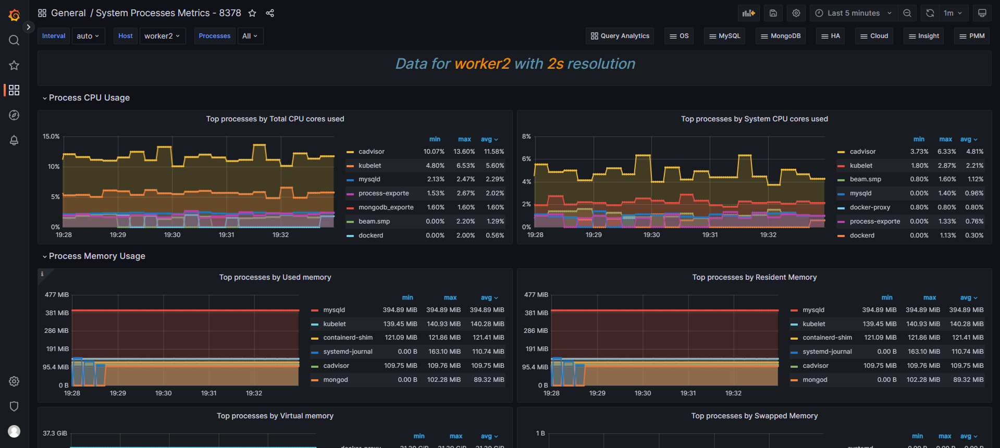

# 系统进程监控

## 1. process exporter

### 1.1 二进制方式安装


### 1.2 docker方式安装

* 创建数据目录
```
mkdir /data/process_exporter
cd /data/process_exporter
```

#### 1.2.1 创建配置文件
* 监控所有的进程
```
cat >>process.yml <<"EOF"
process_names:
  - name: "{{.Comm}}" # 匹配模板
    cmdline:
    - '.+'  # 匹配所有名称
EOF
```

* 监控指定的进程
```
process_names:
#  - name: "{{.Comm}}"
#     cmdline:
#      - '.+'
  - name: "{{.Matches}}"
    cmdline:
    - 'nginx' #唯一标识
  - name: "{{.Matches}}"
    cmdline:
    - 'mongod'
  - name: "{{.Matches}}"
    cmdline:
    - 'mysqld'
  - name: "{{.Matches}}"
    cmdline:
    - 'redis-server'
```

* 配置说明


#### 1.2.2 启动容器
```
docker run -d --rm -p 9256:9256 --privileged -v /proc:/host/proc -v /data/process_exporter:/config --name process-exporter docker.1ms.run/ncabatoff/process-exporter --procfs /host/proc -config.path /config/process.yml
```


## 2. 配置Prometheus
* 将其添加到Prometheus
```
  - job_name: "process_exporter"
    static_configs:
      - targets: ['192.168.50.134:9256']
        labels:
          instance: worker2

```
* 加载Prometheus配置
```
curl -X POST http://192.168.50.120:9090/-/reload
```


## 3. 常见的指标
指标的含义公国访问/metrics接口进行查询，接口中会有对每个meitric的描述

指标名	解释
* namedprocess_namegroup_num_procs	运行的进程数
* namedprocess_namegroup_states	Running/Sleeping/Other/Zombie 状态的进程数
* namedprocess_namegroup_cpu_seconds_total	获取 /proc/[pid]/stat 进程 CPU utime、stime 状态时间
* namedprocess_namegroup_read_bytes_total	获取 /proc/[pid]/io 进程读取字节数
* namedprocess_namegroup_write_bytes_total	获取 /proc/[pid]/io 进程写入字节数
* namedprocess_namegroup_memory_bytes	获取进程使用的内存字节数
* namedprocess_namegroup_open_filedesc	获取进程使用的文件描述符数量
* namedprocess_namegroup_thread_count	运行的线程数
* namedprocess_namegroup_thread_cpu_seconds_total	获取线程 CPU 状态时间
* namedprocess_namegroup_thread_io_bytes_total	获取线程 IO 字节数

指标以`namedprocess_`开头


## 4. 触发器
* 配置Prometheus告警规则
```
cat >> /data/docker-prometheus/prometheus/rules/process-exporter.yml <<"EOF"
groups:
- name: process
  rules:
  - alert: 进程数多告警
    expr: sum(namedprocess_namegroup_states) by (instance) > 1000
    for: 1m
    labels:
      severity: warning
    annotations:
      description: "服务器当前有{{ $value }}个进程"
  - alert: 僵尸进程数告警
    expr: sum by(instance, groupname) (namedprocess_namegroup_states{state="zombie"}) > 0
    for: 1m
    labels:
      severity: warning
    annotations:
      description: "进程{{ $labels.groupname }}有{{ $value }}个僵尸进程"
  - alert: 进程重启告警
    expr: ceil(time() - max by(instance, groupname) (namedprocess_namegroup_oldest_start_time_seconds)) < 60
    for: 15s
    labels:
      severity: warning
    annotations:
      description: "进程{{ $labels.groupname }}在{{ $value }}秒前重启过"
  - alert: 进程退出告警
    expr: max by(instance, groupname) (delta(namedprocess_namegroup_oldest_start_time_seconds{groupname=~"^java.*|^nginx.*"}[1d])) < 0
    for: 1m
    labels:
      severity: warning
    annotations:
      description: "进程{{ $labels.groupname }}退出了"
EOF
```

* 校验Prometheus配置
```
docker exec -it prometheus promtool check config /etc/prometheus/prometheus.yml
```

* 加载Prometheus配置
```
curl -X POST http://192.168.50.120:9090/-/reload
```

## 5. 添加Grafana面板
ID: 8378（采用）



ID： 13882


```
process-exporter升级到0.5.0后，namedprocess_namegroup_cpu_user_seconds_total和namedprocess_namegroup_cpu_system_seconds_total合为一个指标名namedprocess_namegroup_cpu_seconds_total
namedprocess_namegroup_cpu_user_seconds_total变成namedprocess_namegroup_cpu_seconds_total{mode="user"}
namedprocess_namegroup_cpu_system_seconds_total变成namedprocess_namegroup_cpu_seconds_total{mode="system"} 
```

### 5.1 Panel plugin not found


通过`Configuration->Plugins`进行plugin的安装, `marcusolsson-treemap-panel`
* 输入插件的完整名称会找不到插件


### 5.2 `No data`问题


* 可以点击`Edit`进行处理
* 一些指标名称发生了变化或者要通过间接的方式进行查询，需要对promql进行处理，比如

```
topk(5,(rate(namedprocess_namegroup_cpu_user_seconds_total{groupname=~"$processes",instance=~"$host"}[$interval]) 
+
rate(namedprocess_namegroup_cpu_system_seconds_total{groupname=~"$processes",instance=~"$host"}[$interval]))
or 
(irate(namedprocess_namegroup_cpu_user_seconds_total{groupname=~"$processes",instance=~"$host"}[5m])
+
irate(namedprocess_namegroup_cpu_system_seconds_total{groupname=~"$processes",instance=~"$host"}[5m])))
```
* `namedprocess_namegroup_cpu_system_seconds_total`修改为`namedprocess_namegroup_cpu_seconds_total{mode="system"}`

* 同理，`namedprocess_namegroup_cpu_user_seconds_total`修改为`namedprocess_namegroup_cpu_seconds_total{mode="user"}`


* 最终promql修改为
  * 这里`sum by`除了求和之外，还起到将加号两边的结果标签对齐的作用
```
topk(5,sum by (groupname,instance) (rate(namedprocess_namegroup_cpu_seconds_total{groupname=~"$processes",instance=~"$host",mode="user"}[$interval])) 
+
sum by (groupname,instance) (rate(namedprocess_namegroup_cpu_seconds_total{groupname=~"$processes",instance=~"$host",mode="system"}[$interval]))
or 
(sum by (groupname,instance) (irate(namedprocess_namegroup_cpu_seconds_total{groupname=~"$processes",instance=~"$host",mode="user"}[5m]))
+ 
sum by (groupname,instance) (irate(namedprocess_namegroup_cpu_seconds_total{groupname=~"$processes",instance=~"$host",mode="system"}[5m]))))
```
或者
```
topk(5,sum by (groupname, instance) (rate(namedprocess_namegroup_cpu_seconds_total{groupname=~"$processes",instance=~"$host"}[$interval]))
or 
sum by (groupname, instance) (irate(namedprocess_namegroup_cpu_seconds_total{groupname=~"$processes",instance=~"$host"}[5m])))
```


### 5.2.1 比较两个promql
```
topk(5,(rate(namedprocess_namegroup_cpu_seconds_total{groupname=~"$processes",instance=~"$host"}[$interval]))
or 
(irate(namedprocess_namegroup_cpu_seconds_total{groupname=~"$processes",instance=~"$host"}[5m])))
```

* 有重复的进程，修改promql如下，通过sum by (groupname, instance) 去重
```
topk(5,sum by (groupname, instance) (rate(namedprocess_namegroup_cpu_seconds_total{groupname=~"$processes",instance=~"$host"}[$interval]))
or 
sum by (groupname, instance) (irate(namedprocess_namegroup_cpu_seconds_total{groupname=~"$processes",instance=~"$host"}[5m])))
```


