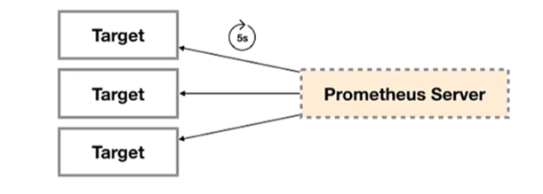

# Exporter

## 1. 概述
所有可以像Prometheus提供监控样本数据的程序都可以称为一个Exporter，而Exporter的一个实例称为target，Prometheus通过轮询的方式定期从这些target中获取监控数据



注：安装好Exporter后会暴露一个http://ip:端口/metrics的HTTP服务，通过Prometheus添加配置 - targets: ['node_exporter:9100']（默认会加上/metrics），Prometheus就可以采集到这个http://ip:端口/metrics里面所有监控样本数据

## 2. Exporter的来源
Exporter的来源分为两类
* 社区提供
* 用户自定义

### 2.1 社区提供
社区Exporter地址：https://prometheus.io/docs/instrumenting/exporters/

Prometheus社区提供了丰富的Exporter实现，涵盖了从基础设施，中间件以及网络等各个方面的监控功能。这些Exporter可以实现大部分通用的监控需求。下表列举一些社区中常用的Exporter

| 范围 | 常用 Exporter

| 数据库 | MySQL Exporter, Redis Exporter, MongoDB Exporter, MSSQL Exporter

| 硬件 | Apcupsd Exporter, IoT Edison Exporter, IPMI Exporter, Node Exporter

| 消息队列 | Beanstalkd Exporter, Kafka Exporter, NSQ Exporter, RabbitMQ Exporter

| 存储 | Ceph Exporter, Gluster Exporter, HDFS Exporter, ScaleIO Exporter

|HTTP 服务 | Apache Exporter, HAProxy Exporter, Nginx Exporter

|API 服务 | AWS ECS Exporter, Docker Cloud Exporter, Docker Hub Exporter, GitHub Exporter

| 日志 | Fluentd Exporter, Grok Exporter

| 监控系统 | Collectd Exporter, Graphite Exporter, InfluxDB Exporter, Nagios Exporter, SNMP Exporter

| 其它 | Blockbox Exporter, JIRA Exporter, Jenkins Exporter, Confluence Exporter


### 2.2 用户自定义
除了直接使用社区提供的Exporter程序以外，用户还可以基于Prometheus提供的Client Library创建自己的Exporter程序，目前Promthues社区官方提供了对以下编程语言的支持：Go、Java/Scala、Python、Ruby。同时还有第三方实现的如：Bash、C++、Common Lisp、Erlang、Haskell、Lua、Node.js、PHP、Rust等


## 3. Exporter类型
通常来说可以将Exporter分为两类：
* 直接采集型

这类Exporter直接内置了相应的应用程序，用于向Prometheus直接提供Target数据支持。这样设计的好处是，可以更好地监控各自系统的内部运行状态，同时也适合更多自定义监控指标的项目实施。例如cAdvisor、Kubernetes等，它们均内置了用于向Prometheus提供监控数据的端点。

* 间接采集型

原始监控目标并不直接支持Prometheus，需要使用Prometheus提供的Client Library编写该监控目标的监控采集程序，用户可以将该程序独立运行，去获取指定的各类监控数据值。例如，由于Linux操作系统自身并不能直接支持Prometheus，用户无法从操作系统层面上直接提供对Prometheus的支持，因此单独安装Node exporter，还有数据库或网站HTTP应用类等Exporter

## 4. Exporter规范
所有的Exporter程序都需要按照Prometheus的规范，返回监控的样本数据。以Node Exporter为例，当访问http://192.168.11.61:9100/metrics地址时会返回以下内容

```
# HELP go_gc_duration_seconds A summary of the pause duration of garbage collection cycles.
# TYPE go_gc_duration_seconds summary
go_gc_duration_seconds{quantile="0"} 1.5294e-05
go_gc_duration_seconds{quantile="0.25"} 3.2443e-05
go_gc_duration_seconds{quantile="0.5"} 3.3932e-05

# HELP node_cpu_seconds_total Seconds the CPUs spent in each mode.
# TYPE node_cpu_seconds_total counter
node_cpu_seconds_total{cpu="0",mode="idle"} 254831.12
```
以 #开始的行通常都是注释内容。这些样本数据集说明如下：
* 以#HELP开始的行，表示metric的帮助与说明注释，可以包含当前监控指标名称和对应的说明信息。
* 以#TYPE开始的行，表示定义metric类型，可以包含当前监控指标名称和类型，类型有Counter、Gauge、Histogram、Summary

非#开头的行，就是监控样本数据 
