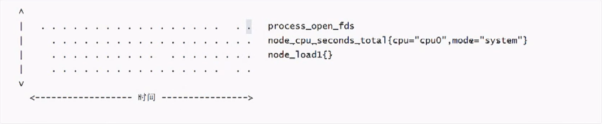
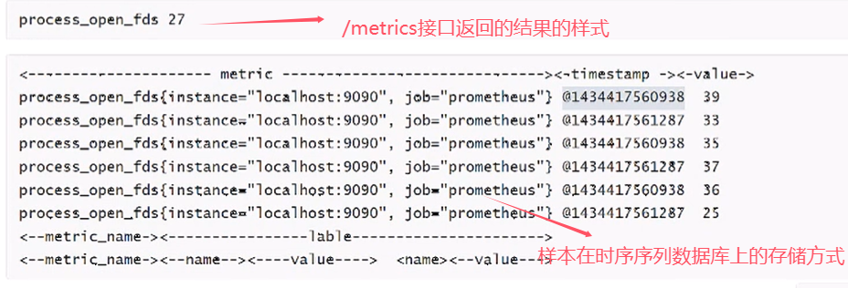

# Prometheus concept

## 1. 理解时间序列
安装好Prometheus后暴漏一个/metrics的HTTP服务(相当于安装了prometheus-exporter)，通过配置(默认会加上/metrics),Prometheus就可以采集到这个/metrics里面的所有监控样本信息

## 2. 样本
Prometheus会将所有采集到的监控样本数据以时间序列的方式保存在**内存数据库**中，并且定时保存到硬盘上。


时间序列中的每一个点称为一个样本，样本由以下三部分组成：
- 指标(metric)：指标名称和它的标签(label)键值对
- 时间戳(timestamp)：一个精确到毫秒的时间戳
- 样本值(value)：一个float64的浮点型数据表示样本的值




## 3. 指标(metric)
在形式上，所有的指标 (metric) 都通过如下格式标识
```
<metric name>{<label name>=<label value>, ...}
```
* 指标的名称 (metric name) 可以反映被监控样本的含义（比如，process_open_fds - 表示当前系统打开的文件描述符）。指标名称只能由 ASCII 字符、数字、下划线以及冒号组成并必须符合正则表达式[a-zA-Z:][a-zA-Z0-9:]*。
* 标签 (label) 反映了当前样本的特征维度，通过这些维度 Prometheus 可以对样本数据进行过滤，聚合等。标签的名称只能由 ASCII 字符、数字以及下划线组成并满足正则表达式[a-zA-Z_][a-zA-Z0-9_]*。
* 其中以__作为前缀的标签，是系统保留的关键字，只能在系统内部使用。标签的值则可以包含任何 Unicode 编码的字符。在 Prometheus 的底层实现中指标名称实际上是以__name__=<metric name>的形式保存在数据库中的，因此以下两种方式均表示的同一条 time-series
```
process_open_fds{instance="localhost:9090", job="prometheus"}
```
等同于
```
__name__="process_open_fds",instance="localhost:9090",job="prometheus"}
```

## 4. 指标(metric)4种类型

Prometheus底层存储上其实并没有对指标做类型的区分，都是以时间序列的形式存储，但是为了方便用户的使用和理解不同监控指标之间的差异，Prometheus定义了counter（计数器）、gauge（仪表盘）、histogram（直方图）以及summary（摘要）这四种Metrics类型

Gauge/Counter是数值指标，代表数据的变化情况，Histogram/Summary是统计类型的指标，表示数据的分布情况

在Exporter返回的样本数据中，其注释中也包含了该样本的类型


### 4.1 Counter（计数器）
Counter类型的指标其工作方式和计数器一样，**只增不减（除非系统发生重置）**。常见的监控指标，如 http_requests_total等都是Counter类型的监控指标。一般在定义Counter类型指标的名称时推荐使用_total作为后缀

通过Counter指标可以统计HTTP请求数量，请求错误数，接口调用次数等单调递增的数据，同时可结合increase和rate等函数统计变化速率

* 通过PromQL内置的聚合rate()函数获取HTTP请求量的平均增长率：
```
rate(prometheus_http_requests_total[5m])
```
* 查询当前系统中，访问量前10的HTTP地址
```
topk(10, prometheus_http_requests_total)
```

### 4.2 Gauge（仪表盘）
与Counter不同，Gauge类型的指标侧重于反应系统的当前状态。因此这类指标的样本**数据可增可减**。常见指标如：node_memory_MemFree_bytes（主机当前空闲的物理内存大小）、node_memory_MemAvailable_bytes（可用内存大小）都是 Gauge 类型的监控指标

通过Gauge指标，使用PromQL可以直接查看系统的当前空闲物理内存大小
```
node_memory_MemFree_bytes
```

* 对于Gauge类型的监控指标，通过PromQL内置函数delta()可以获取样本在一段时间范围内的变化情况。例如，计算CPU温度在两个小时内的差异
```
delta(cpu_temp_celsius{host="zeus"}[2h])
```
* 还可以使用deriv()计算样本的线性回归模型，甚至是直接使用predict_linear()对数据的变化趋势进行预测。例如，预测系统磁盘空间在4个小时之后的剩余情况
```
predict_linear(node_filesystem_avail_bytes{}[1h], 4 * 3600)
```

> PromQL函数
* delta()函数：用于获取样本在一段时间内的变化情况。delta(cpu_temp_celsius{host="zeus"}[2h])，表示计算主机“zeus”的CPU温度在两小时内的差异

* deriv()函数：可计算样本的线性回归模型。

* predict_linear()函数：用于对数据的变化趋势进行预测。predict_linear(node_filesystem_avail_bytes{}[1h], 4 * 3600)，表示根据过去1小时的系统磁盘可用空间数据，预测4个小时后的剩余情况


### 4.3 Histogram（直方图）和 Summary（摘要）
除了Counter和Gauge类型的监控指标以外，Prometheus还定义了Histogram和Summary的指标类型。Histogram和Summary主要用于统计和分析样本的分布情况

在大多数情况下人们都倾向于使用某些量化指标的平均值，例如CPU的平均使用率、页面的平均响应时间。这种方式的问题很明显，以系统API调用的平均响应时间为例：如果大多数API请求都维持在100ms的响应时间范围内，而个别请求的响应时间需要5s，那么就会导致某些WEB页面的响应时间落到中位数的情况，而这种现象被称为长尾问题

为了区分是平均的慢还是长尾的慢，最简单的方式就是按照请求延迟的范围进行分组。例如，统计延迟在0-10ms之间的请求数有多少，而10-20ms之间的请求数又有多少。通过这种方式可以快速分析系统慢的原因。Histogram和Summary都是为了能够解决这样问题的存在，通过Histogram和Summary类型的监控指标，可以快速了解监控样本的分布情况。

例如，指标prometheus_tsdb_wal_fsync_duration_seconds的指标类型为Summary。它记录了Prometheus Server中wal_fsync处理的处理时间，通过访问Prometheus Server的/metrics 地址，可以获取到以下监控样本数据：
```
# HELP prometheus_tsdb_wal_fsync_duration_seconds Duration of WAL fsync.
# TYPE prometheus_tsdb_wal_fsync_duration_seconds summary
prometheus_tsdb_wal_fsync_duration_seconds{quantile="0.5"} 0.012352463
prometheus_tsdb_wal_fsync_duration_seconds{quantile="0.9"} 0.014458005
prometheus_tsdb_wal_fsync_duration_seconds{quantile="0.99"} 0.017316173
prometheus_tsdb_wal_fsync_duration_seconds_sum 2.888716127000002
prometheus_tsdb_wal_fsync_duration_seconds_count 216
```
* 从上面的样本中可以得知当前Prometheus Server进行wal_fsync操作的总次数为216次，耗时2.888716127000002s。其中中位数（quantile=0.5）的耗时为0.012352463，9分位数（quantile=0.9）的耗时为0.014458005s


在Prometheus Server自身返回的样本数据中，还能找到类型为Histogram的监控指标
```
# HELP prometheus_tsdb_compaction_chunk_range_seconds Final time range of chunks on their first compaction
# TYPE prometheus_tsdb_compaction_chunk_range_seconds histogram
prometheus_tsdb_compaction_chunk_range_seconds_bucket{le="100"} 0
prometheus_tsdb_compaction_chunk_range_seconds_bucket{le="400"} 0
prometheus_tsdb_compaction_chunk_range_seconds_bucket{le="1600"} 0
prometheus_tsdb_compaction_chunk_range_seconds_bucket{le="6400"} 0
prometheus_tsdb_compaction_chunk_range_seconds_bucket{le="25600"} 61
prometheus_tsdb_compaction_chunk_range_seconds_bucket{le="102400"} 1095
prometheus_tsdb_compaction_chunk_range_seconds_bucket{le="409600"} 1208
prometheus_tsdb_compaction_chunk_range_seconds_bucket{le="1.6384e+06"} 3184
prometheus_tsdb_compaction_chunk_range_seconds_bucket{le="6.5536e+06"} 217665
prometheus_tsdb_compaction_chunk_range_seconds_bucket{le="2.62144e+07"} 217695
prometheus_tsdb_compaction_chunk_range_seconds_bucket{le="+Inf"} 217695
prometheus_tsdb_compaction_chunk_range_seconds_sum 3.912540158e+11
prometheus_tsdb_compaction_chunk_range_seconds_count 217695
```
* 与Summary类型的指标相似之处在于Histogram类型的样本同样会反应当前**指标的记录的总数(以_count作为后缀)以及其值的总量（以_sum作为后缀）**。不同在于**Histogram指标直接反应了在不同区间内样本的个数，区间通过标签le进行定义**

同时对于Histogram的指标，还可以通过histogram_quantile()函数计算出其值的分位数。不同于Histogram通过 **histogram_quantile函数是在服务器端计算的分位数，而Summary的分位数则是直接在客户端计算完成。因此对于分位数的计算而言，Summary在通过PromQL进行查询时有更好的性能表现，而Histogram则会消耗更多的资源**。反之对于客户端而言 Histogram 消耗的资源更少。在选择这两种方式时用户应该按照自己的实际场景进行选择

需要特别注意的是，假设采样数据metric叫做x(指标名)，如果x是histogram或summary类型必需满足以下条件:
* 采样数据的总和应表示为x_sum
* 采样数据的总量应表示为x_count
* summary类型的采样数据的quantile应表示为x{quantile="y"}
* histogram类型的采样分区统计数据将表示为x_bucket{le="y"}
* **histogram类型的采样必须包含x_bucket{le="+Inf"}，它的值等于x_count的值**
* summary和histogram中quantile和le必需按从小到大顺序排列

reload Prometheus的配置文件
```
curl -X POST http://localhost:9090/-/reload
```

## 5. job(任务)和instance(实例)

### 5.1 概述
在Prometheus中，任何被采集的目标，即每一个暴露监控样本数据的HTTP服务都称为一个实例（Instance），例如在当前主机上运行的node exporter可以被称为一个实例（Instance）。而具有相同采集目的的实例集合称为任务（Job）。


### 5.2 job（任务）
例如，以下2个复制实例的node作业
```
* job: node
  * instance 2: 1.2.3.4:9100
  * instance 4: 5.6.7.8:9100
```
* 同样的抓取任务(job)，部署在不同的机器上，部署在n机器上就有n个实例(instance)

### 5.3 instances（实例）
通过在prometheus.yml配置文件中，添加如下配置。让Prometheus可以从node exporter暴露的服务中获取监控指标数据
```
scrape_configs:
  - job_name: 'prometheus'
    static_configs:
      - targets: ['prometheus:9090']
  - job_name: 'alertmanager'
    static_configs:
      - targets: ['alertmanager:9093']
  - job_name: 'node_exporter'
    static_configs:
      - targets: ['node-exporter:9100','192.168.11.62:9100']
```
* 当需要采集不同的监控指标 (例如：主机、MySQL、Nginx) 时，只需要运行相应的监控采集程序，在Prometheus Server配置这些Exporter实例的访问地址

### 5.4 实例的状态

