# 基础使用

PromQL(Prometheus Query Language)是Prometheus自己开发的数据查询DSL语言，语言表现力非常丰富，内置函数很多，在日常数据可视化 (Grafana) 以及rule告警中都会使用到

## 1. PromQL数据类型
在Prometheus的表达式语言中，PromQL数据类型归类为以下四种：
* 瞬时向量（instant vector），是指同一时刻的一组时间序列，每个时间序列包含一个样本，所有样本共享相同的时间戳，即每个时序只有一个点
* 区间向量（range vector），是指在任何一个时间范围内的一组时间序列，包含每个时间序列随时间变化的一系列数据点，这时每个时序有多个点
* 标量（scalar），即纯量数据，一个简单的数字浮点值，只有一个数字，没有时序
* 字符串（string），一个目前未被使用的简单字符串值

### 1.1 瞬时向量（Instant vector）
在Prometheus的查询页面输入指标`node_memory_Active_bytes`进行查询，查询结果如下
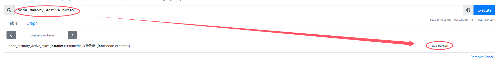

### 1.2 区间向量（range vector）
在Prometheus的查询页面输入指标`node_memory_Active_bytes[1m]`进行查询，查询结果如下
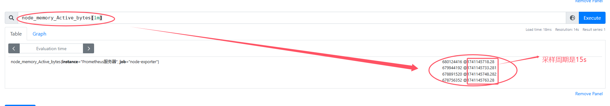

### 1.3 标量（scalar）
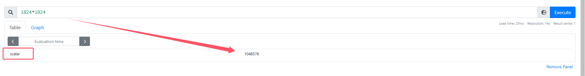

### 1.4 字符串（string）
暂未使用


## 2. 时间序列过滤器

### 2.1 瞬时向量过滤器
瞬时向量过滤器允许在指定的时间戳内选择一组时间序列和每个时间序列的单个样本值。在最简单的形式中，仅指定指标（metric）名称。这将生成包含此指标名称的所有时间序列的元素的瞬时向量
* 例如：选择指标名称为node_cpu_seconds_total的所有时间序列：
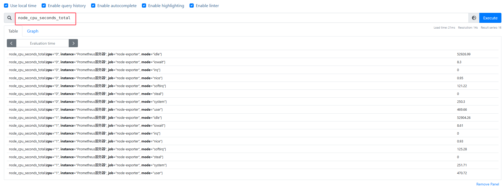

可以通过向花括号{}里附加一组标签来进一步过滤时间序列
* 例如：选择指标名称为node_cpu_seconds_total，`instance`标签值为`Prometheus服务器`，`mode`标签值为`idle`的时间序列
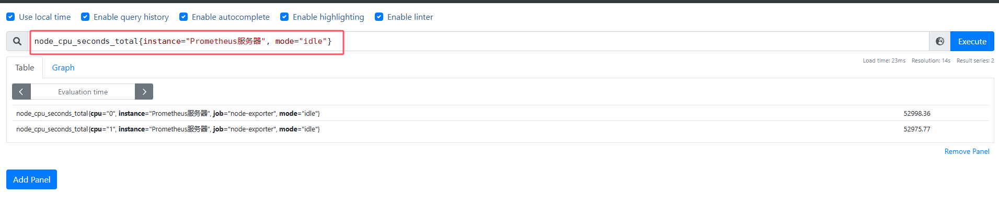

PromQL还支持用户根据时间序列的标签匹配模式来对时间序列进行过滤，目前主要支持两种匹配模式：完全匹配和正则匹配。总共有以下几种标签匹配运算符：
* =：选择与提供的字符串完全相同的标签
* !=：选择与提供的字符串不相同的标。
* =~：选择正则表达式与提供的字符串（或子字符串）相匹配的标签。
* !~：选择正则表达式与提供的字符串（或子字符串）不匹配的标签

```
node_cpu_seconds_total{cpu="0", mode!="iowait", mode=~"idle|nice", instance=~"Prometheus.*"}
```
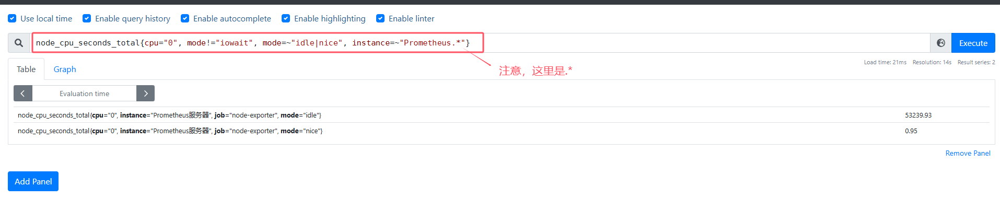

注意事项：
* 没有指定标签的标签过滤器会选择该指标名称的所有时间序列
* Prometheus中的所有正则表达式都使用RE2语法。
* 所有的PromQL表达式必须至少包含一个指标名称，或者一个不会匹配到空字符串的标签过滤器。
* 除了使用`<metric name>{label=value}`的形式以外，还可以使用内置的`__name__`标签来指定监控指标名称。例如：表达式`node_cpu_seconds_total`等效于`{name="node_cpu_seconds_total"}`

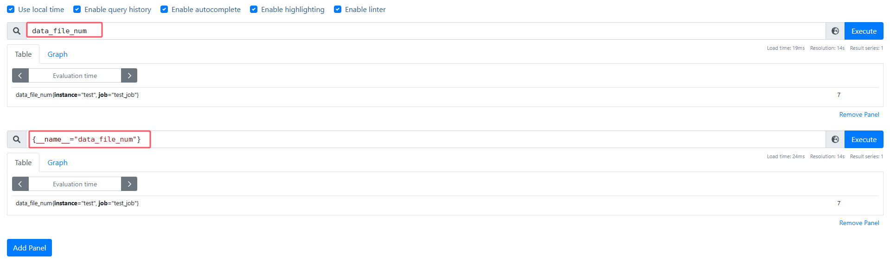

### 2.2 区间向量选择器
区间向量与瞬时向量的工作方式类似，唯一的差异在于区间向量表达式中需要**定义时间选择的范围**，时间范围通过时间范围选择器[]进行定义，以指定应为每个返回的区间向量样本值中提取多长的时间范围

时间范围通过数字来表示，单位可以使用以下其中之一的时间单位：
* s - 秒
* m - 分钟
* h - 小时
* d - 天
* w - 周
* y - 年

例如：选择在过去1分钟内指标名称为node_cpu_seconds_total，job标签值为`node-exporter`的所有时间序列
```
node_cpu_seconds_total{job="node-exporter"}[1m]
```
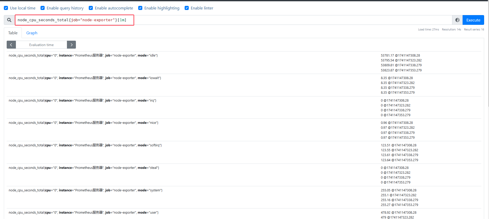

* 这种查询只适用于table，不适用于graph
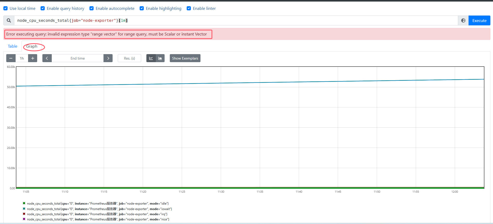


### 2.3 时间位移操作
在瞬时向量表达式或者区间向量表达式中，都是以当前时间为基准
```
node_cpu_seconds_total{}  # 瞬时向量表达式，选择当前最新的数据
node_cpu_seconds_total{}[5m]  # 区间向量表达式，选择以当前时间为基准，5分钟内的数据
```
而如果想查询，5分钟前的瞬时样本数据，或昨天一天的区间内的样本数据呢？这个时候就可以使用位移操作，位移操作的关键字为`offset`


例如，以下表达式返回相对于当前查询时间过去5分钟的`node_cpu_seconds_total`值
```
node_cpu_seconds_total{ instance="Prometheus服务器", mode="idle"} offset 5m
```
* **offset关键字需要紧跟在选择器{}后面**,以下表达式是正确的：
```
sum(node_cpu_seconds_total{ instance="Prometheus服务器", mode="idle"} offset 5m)
```
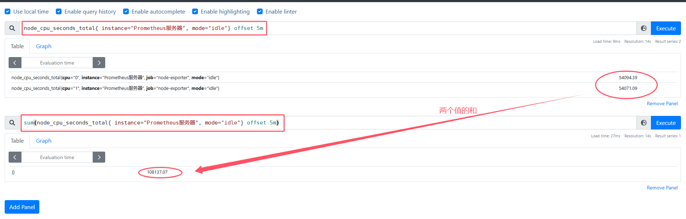

下面的表达式是不合法的
```
sum(node_cpu_seconds_total{ instance="Prometheus服务器", mode="idle"}) offset 5m
```
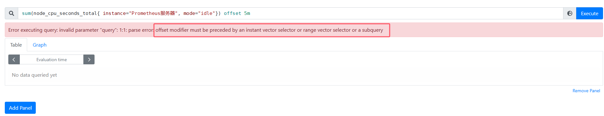