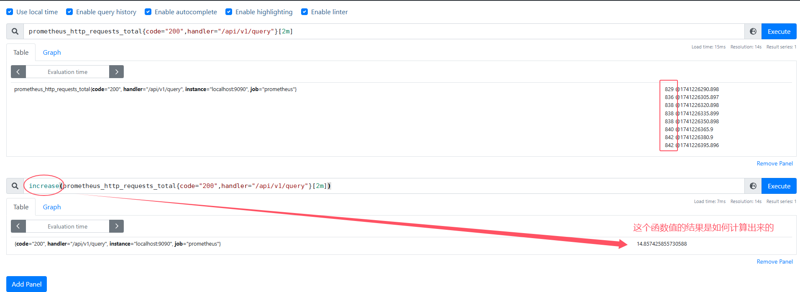
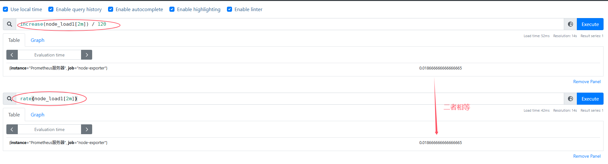
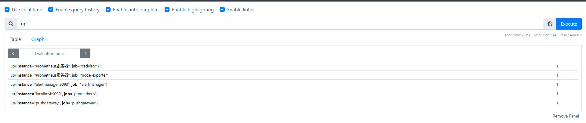
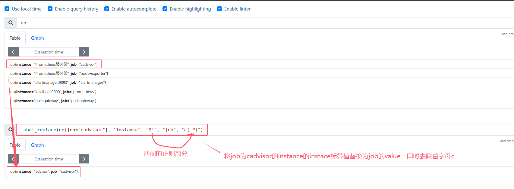
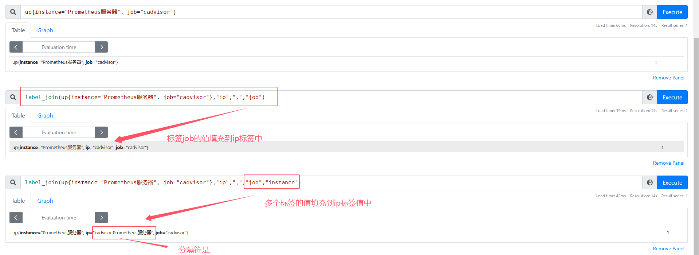

# 内置函数

## 1. 数学函数
### 1.1 abs()
abs(v instant-vector) 返回所有样本的绝对值。

### 1.2 ceil()
ceil(v instant-vector) 返回所有样本的上入整数。

### 1.3 floor()
floor(v instant-vector) 返回所有样本的下舍整数。

### 1.4 round()
round(v instant-vector, to_nearest=1) 返回四舍五入后的所有样本值。

### 1.5 exp()
exp(v instant-vector) 返回所有样本值的 e 的指数值。

### 1.6 ln()
ln(v instant-vector) 返回所有样本值的自然对数。

### 1.7 sqrt()
sqrt(v instant-vector) 返回所有样本值的平方根。

### 1.8 pow()
pow(v instant-vector, exponent scalar) 返回所有样本值的次方值。

## 2. 时间函数
Prometheus使用的是协调世界时（UTC），没有时区的概念。为了使用户在使用中不用自己实现与日期相关的逻辑，Prometheus提供了一些时间函数

### 2.1 time()
time() 返回从1970-01-01到现在的秒数。

* 查看进程运行了多长时间，可以使用表达式
```
time()-process_start_time_seconds
```
* 触发器案例：证书还有30天到期
```
probe_ssl_earliest_cert_expiry - time() < 86400 * 30
```

### 2.2 timestamp()
timestamp(v instant-vector) 返回所有样本的时间戳。

### 2.3 delta()
delta(v range-vector) 计算在指定时间范围内的范围向量中每个时间序列元素的差值。

### 2.4 idelta()
idelta(v range-vector) 计算在指定时间范围内的范围向量中每个时间序列元素的差值，只有当时间序列元素的值单调递增时才有效。

### 2.5 rate()
rate(v range-vector) 计算范围向量 v 在时间窗口内平均每秒增长量。

### 2.6 irate()
irate(v range-vector) 计算范围向量 v 在时间窗口内平均每秒增长量，并且忽略极少数异常点。

### 2.7 increase()
increase(v range-vector) 计算范围向量 v 在时间窗口内增长量。

### 2.8 deriv()
deriv(v range-vector) 使用简单线性回归的方式计算范围向量 v 在时间窗口内平均每秒增长量。

### 2.9 changes()

## 3. 计算Counter指标增长率函数
Counter类型的监控指标其特点是只增不减，在没有发生重置（如服务器重启，应用重启）的情况下其样本值应该是不断增大的。为了能够更直观表示样本数据的变化剧烈情况，需要计算样本的增长速率

### 3.1 increase()
increase(v range-vector)函数是PromQL中提供的众多内置函数之一。其中参数v是一个区间向量，increase函数获取区间向量中的第一个和最后一个样本并返回其增长量。因此，可以通过以下表达式Counter类型指标的增长率
```
increase(node_load1[2m]) / 120
```
* 这里橘绿node_load1不太合适，因为这个指标不是Counter类型，而是gauge类型，这个指标表示的是当前系统的负载，会随着系统的使用情况变化而变化，所以使用increase函数计算的结果并不准确
* 通过node_load1[2m]获取时间序列最近两分钟的所有样本，increase计算出最近两分钟的增长量，最后除以时间120秒得到node_cpu样本在最近两分钟的平均增长率



### 3.2 rate()
除了使用increase函数以外，PromQL中还直接内置了rate(v range-vector) 函数，rate函数可以直接计算区间向量v在时间窗口内平均增长速率。因此，通过以下表达式可以得到与increase函数相同的结果
```
rate(node_load1[2m])
```


### 3.3 irate()
需要注意的是使用rate或者increase函数去计算样本的平均增长速率，容易陷入 “长尾问题” 当中，其无法反应在时间窗口内样本数据的大变化。例如，对于主机而言在2分钟的时间窗口内，可能在某一个由于访问量或者其它问题导致CPU占用100%的情况，但是通过计算在时间窗口内的平均增长率却无法反应出该问题

为了解决该问题，PromQL提供了另外一个灵敏度更高的函数irate(v range-vector)。irate同样用于计算区间向量的计算率，但是其反应出的是瞬时增长率。irate函数是通过**区间向量中最后两个样本数据来计算区间向量的增长速率**。这种方式可以避免在时间窗口范围内的 “长尾问题”，并且体现出更好的灵敏度，通过irate函数绘制的图标能够更好的反应样本数据的瞬时变化状态

```
irate(node_load1[2m])
```
* irate函数相比于rate函数提供了更高的灵敏度，不过当需要分析长期趋势或者在告警规则中，irate的这种灵敏度反而容易造成干扰。因此在长期趋势分析或者告警中更推荐使用rate函数


## 4. 预测Gauge指标变化趋势函数
在一般情况下，系统管理员为了确保业务的持续可用运行，会针对服务器的资源设置相应的告警阈值。例如，当磁盘空间只剩512MB时向相关人员发送告警通知。这种基于阈值的告警模式对于当资源用量是平滑增长的情况下是能够有效的工作的。但是如果资源不是平滑变化的呢？比如**有些某些业务增长，存储空间的增长速率提升了高几倍。这时，如果基于原有阈值去触发告警，当系统管理员接收到告警以后可能还没来得及去处理问题，系统就已经不可用了**。因此阈值通常来说不是固定的，需要定期进行调整才能保证该告警阈值能够发挥去作用。那么还有没有更好的方法吗？

PromQL中内置的predict_linear(v range-vector,t scalar) 函数可以帮助系统管理员更好的处理此类情况，**predict_linear函数可以预测时间序列v在t秒后的值**。它基于简单线性回归的方式，对时间窗口内的样本数据进行统计，从而可以对时间序列的变化趋势做出预测。例如，基于1小时的样本数据，来预测主机可用磁盘空间的是否在24个小时后被占满，可以使用如下表达式：
```
predict_linear(node_filesystem_avail_bytes{fstype!~"tmpfs"}[1h], 24 * 3600) < 0
```

node_exporter触发器解释
```
(node_filesystem_avail_bytes * 100) / node_filesystem_size_bytes < 10 and ON (instance, device, mountpoint) predict_linear(node_filesystem_avail_bytes{fstype!~"tmpfs"}[1h], 24 * 3600) < 0 and ON (instance, device, mountpoint) node_filesystem_readonly == 0
```
该表达式通过多个条件的组合判断，筛选出磁盘可用率低、未来磁盘空间可能被占满且文件系统不是只读的情况。只有当所有条件都满足时，表达式结果才为true ，可用于触发相应告警等操作
* (node_filesystem_avail_bytes * 100) / node_filesystem_size_bytes < 10
  * node_filesystem_avail_bytes是一个指标，代表磁盘剩余空间大小（以字节为单位）
  * node_filesystem_size_bytes也是一个指标，表示磁盘总大小（字节）
  * (node_filesystem_avail_bytes * 100) / node_filesystem_size_bytes 的作用是计算磁盘的可用率，将剩余空间转换为百分比形式
  * 整个子表达式判断磁盘可用率是否小于10%，如果小于则该部分结果为true ，否则为false

* ON (instance, device, mountpoint)：
  * 这是向量匹配修饰符，用于限定后续向量匹配操作基于instance（实例）、device（设备）、mountpoint（挂载点）这几个标签进行匹配

* predict_linear(node_filesystem_avail_bytes{fstype!~"tmpfs"}[1h], 24 * 3600) < 0：
  * node_filesystem_avail_bytes{fstype!~"tmpfs"} 表示筛选出文件系统类型不是临时文件系统（tmpfs）的磁盘剩余空间指标数据
  * [1h] 是时间范围选择器，表示取过去1小时的数据，构成一个区间向量
  * predict_linear是一个函数，基于简单线性回归对时间窗口内（这里是1小时）的样本数据进行统计，预测node_filesystem_avail_bytes这个时间序列在24*3600秒（即24小时）后的取值
  * 该子表达式判断预测的磁盘剩余空间值是否小于0，如果小于0，意味着预计24小时后磁盘空间会被占满，结果为true，否则为false


* node_filesystem_readonly == 0：
  * node_filesystem_readonly是一个指标，用于表示文件系统是否为只读状态。当值为0时，表示文件系统不是只读；值为 1 时，表示文件系统是只读
  * 该子表达式判断文件系统是否不是只读状态，如果不是只读则结果为true，否则为false

## 5. 标签操作函数
一般来说，使用PromQL查询到时间序列后，可视化工具会根据时间序列的标签来渲染图表。例如通过up指标可以获取到当前所有运行的Exporter实例以及其状态


为了能够让客户端的图标更具有可读性，可以通过label_replace标签为时间序列添加额外的标签。label_replace的具体参数如下：
```
label_replace(v instant-vector, dst_label string, replacement string, src_label string, regex string)
```
* v：表示时间序列数据
* dst_label：表示目标标签名
* replacement：表示目标标签的值，可以使用$1，$2等来引用正则表达式分组
* src_label：表示源标签名
* regex：表示正则表达式，用于匹配源标签的值

例如，通过label_replace函数将instance标签的值中的IP地址替换为host标签的值：
```
label_replace(up{job="cadvisor"}, "instance", "$1", "job", "c(.*)")
```



除了label_replace以外，Prometheus还提供了label_join函数，该函数可以将时间序列中v多个标签src_label的值，通过separator作为连接符写入到一个新的标签dst_label中
```
label_join(v instant-vector, dst_label string, separator string, src_label_1 string, src_label_2 string, ...)
```
* v：表示时间序列数据
* dst_label：表示目标标签名
* separator：表示连接符
* src_label_x：表示源标签名

```
label_join(up{instance="Prometheus服务器", job="cadvisor"},"ip",",","job")
label_join(up{instance="Prometheus服务器", job="cadvisor"},"ip",",","job","instance")
```


