# PromQL操作符

## 1. 二元运算符
Prometheus的查询语言支持基本的逻辑运算和算术运算。对于两个瞬时向量，匹配行为可以被改变。

### 1.1 算术二元运算符
在Prometheus系统中支持下面的二元算术运算符：
* 、+ 加法
* \- 减法
* \* 乘法
* / 除法
* % 模
* ^ 幂等

二元运算操作符支持 scalar/scalar (标量 / 标量)、vector/scalar (瞬时向量 / 标量)、和 vector/vector (瞬时向量 / 瞬时向量) 之间的操作

在**两个标量**之间进行数学运算，得到的结果也是标量
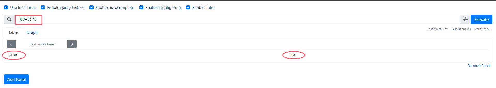

**瞬时向量和标量**之间进行算数运算时，算术运算符会一次作用与即时向量中的每一个样本值，从而得到一组新的时间序列
* 例如：通过监控指标node_memory_MemTotal_bytes（主机内存总大小）单位为byte，如果换成mb时
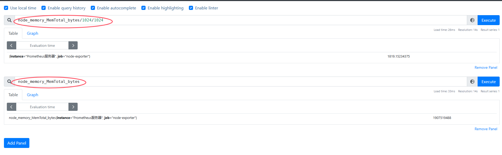


**瞬时向量与瞬时向量**之间进行数学运算时，过程会相对复杂一点。
运算符会依次找到与左边向量元素匹配（标签完全一致）的右边向量元素进行运算，如果没找到匹配元素，则直接丢弃。同时新的时间序列将不会包含指标名称

例如，如果用`node_memory_MemAvailable_bytes`（可用内存）和`node_memory_MemTotal_bytes`（总内存）获取内存可用率%，可以使用如下表达式

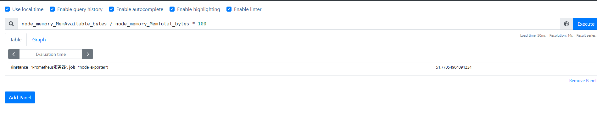


### 1.2 关系运算符
目前，Prometheus 支持以下关系运算符：
* == (相等)
* != (不相等)
* \> (大于)
* \< (小于)
* \>= (大于等于)
* <= (小于等于)

关系运算符被应用于**scalar/scalar（标量/标量）、vector/scalar（瞬时向量/标量），和vector/vector（瞬时向量/瞬时向量）**。默认情况下关系运算符只会根据时间序列中样本的值，对时间序列进行过滤。可以通过**在运算符后面使用bool修饰符来改变关系运算的默认行为**。使用bool修改符后，关系运算不会对时间序列进行过滤，而是直接依次瞬时向量中的各个样本数据与标量的比较结果0或者1

在两个标量之间进行关系运算，必须提供bool修饰符，得到的结果也是标量，即0（false或1（true）

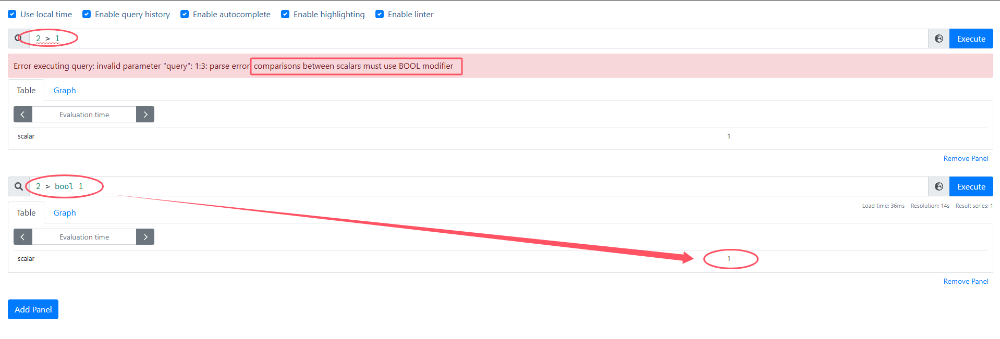

**瞬时向量和标量**之间的关系运算，这个运算符会应用到某个当前时刻的每个时序数据上，如果一个时序数据的样本值与这个标量比较的结果是false，则这个时序数据被丢弃掉，如果是true，则这个时序数据被保留在结果中。如果提供了bool修饰符，那么比较结果是0的时序数据被丢弃掉，而比较结果是1的时序数据被保留
```
node_load1 > 1     # 结果为 true 或 false
node_load1 > bool 1 # 结果为 1 或 0
up == 1 
up != 1
```

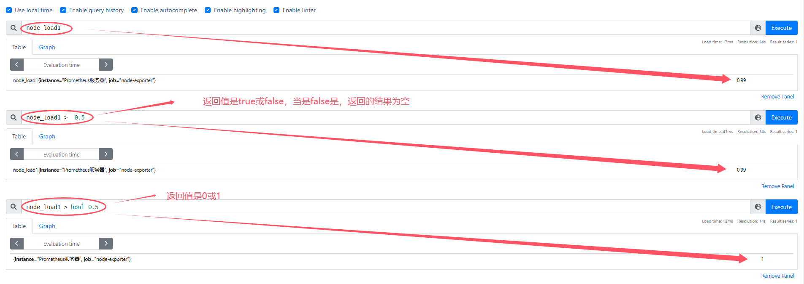

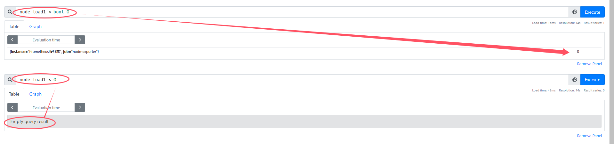

**瞬时向量与瞬时向量**直接进行关系运算时，同样遵循默认的匹配模式：依次找到与左边向量元素匹配（标签完全一致）的右边向量元素进行相应的操作，如果没找到匹配元素，或者计算结果为false，则直接丢弃。如果匹配上了，则将左边向量的度量指标和标签的样本数据写入瞬时向量。如果提供了bool修饰符，那么比较结果是0的时序数据被丢弃掉，而比较结果是1的时序数据（只保留左边向量）被保留

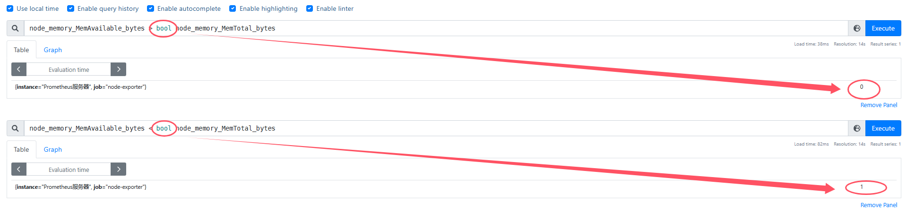

### 1.3 集合运算符
使用瞬时向量表达式能够获取到一个包含多个时间序列的集合，称为瞬时向量。通过集合运算，可以在两个瞬时向量与瞬时向量之间进行相应的集合操作。目前，Prometheus支持以下集合运算符：
* and (并且)
* or (或者)
* unless (排除)

vector1 and vector2会产生一个由vector1的元素组成的新的向量。该向量包含vector1中完全匹配vector2中的元素

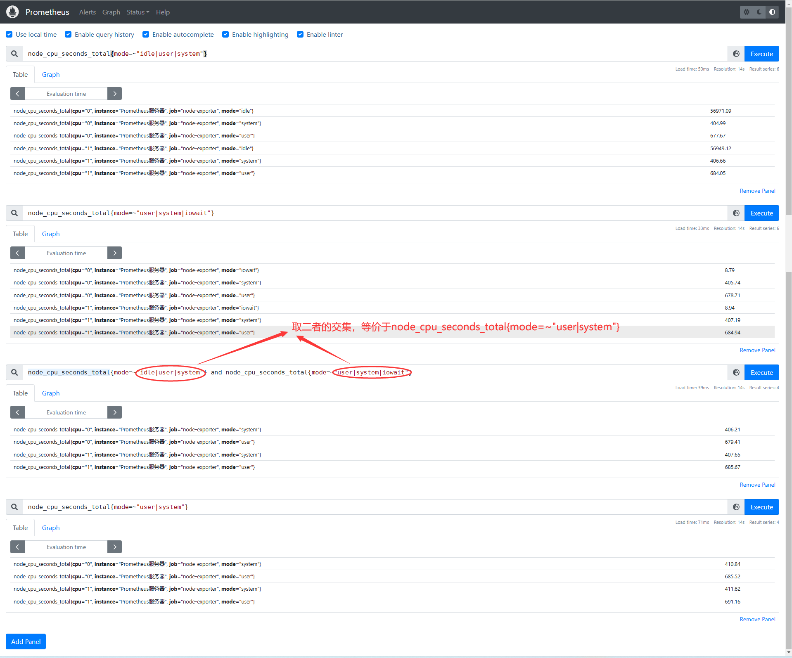

vector1 or vector2会产生一个新的向量，该向量包含vector1的所有原始元素（标签集 + 值）的向量，以及 vector2中没有与vector1匹配标签集的所有元素

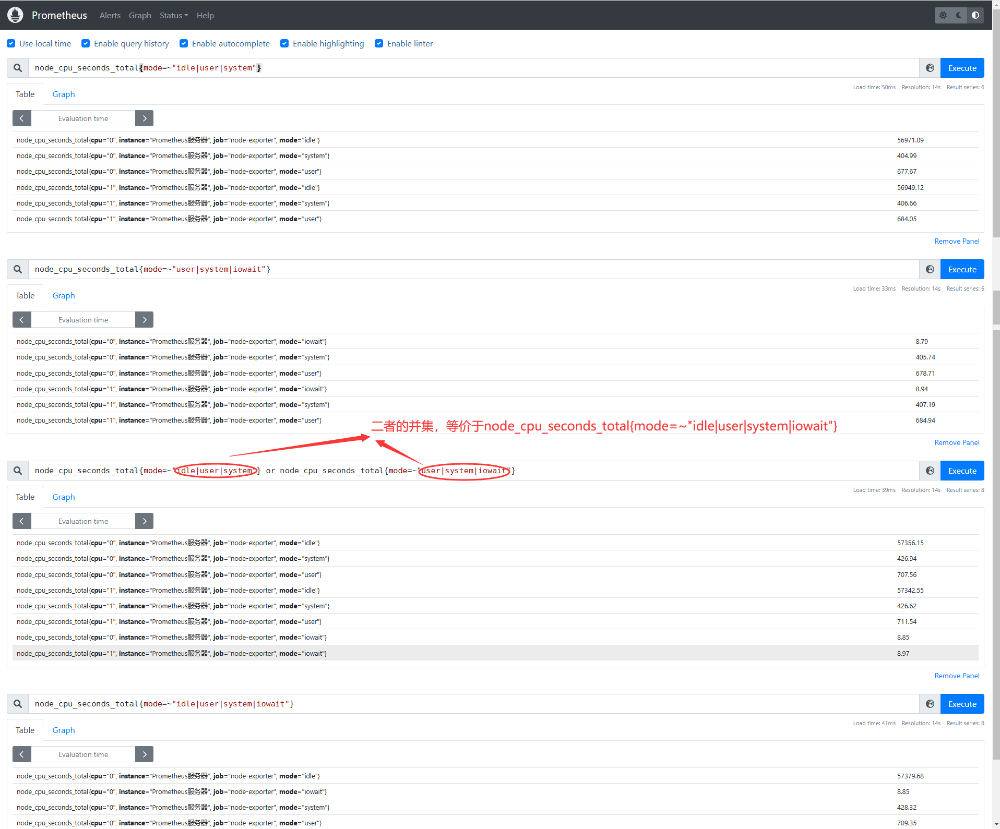

vector1 unless vector2会产生一个由vector1的元素组成的向量，而这些元素在vector2中没有与标签集完全匹配的元素，两个向量中的所有匹配元素都被删除

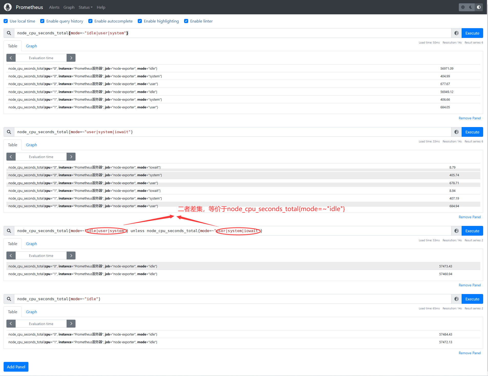

**总结：集合运算符作用于前后两个瞬时向量时，and和or和unless操作符是求两个瞬时向量的交集和并集和差集**


## 2. 聚合操作
Prometheus提供了下列内置的聚合操作符，这些操作符作用域瞬时向量。可以将瞬时表达式返回的样本数据进行聚合，形成一个具有较少样本值的新的时间序列
* sum (求和)
* min (最小值)
* max (最大值)
* avg (平均值)
* stddev (标准差)
* stdvar (标准差异)
* count (计数)
* count_values (对 value 进行计数)
* bottomk (样本值最小的 k 个元素)
* topk (样本值最大的 k 个元素)
* quantile (分布统计)

这些操作符被用于聚合所有标签维度，或者通过without或者by子语句来保留不同的维度
```
<aggr-op>([parameter,] <vector expression>) [without|by (<label list>)]
```
* 其中只有count_values，quantile，topk，bottomk支持参数 (parameter)
* without (排除标签名称)
* by (保留标签名称) ：类似sql的：group by

### 2.1 sum 求和
* 对指标的value进行求和

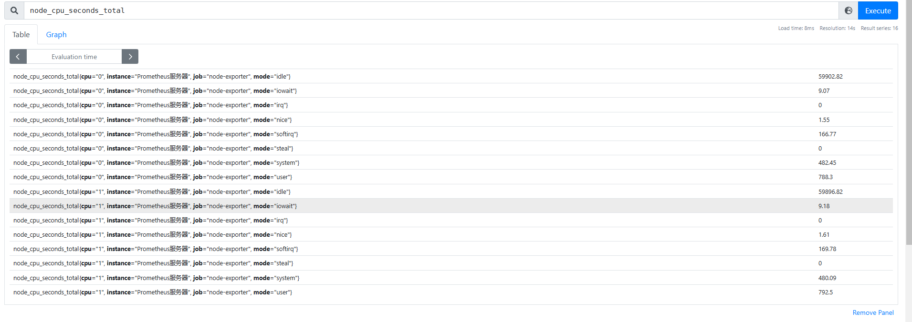
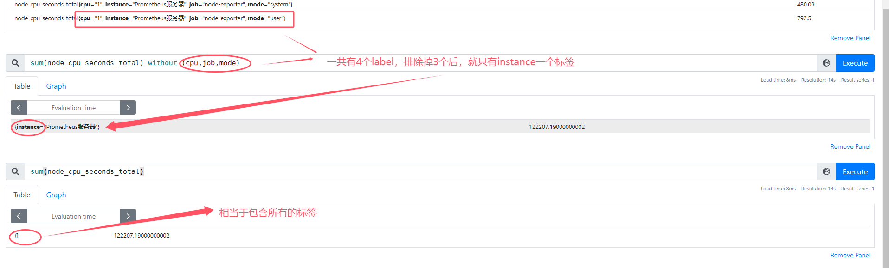

### 2.2 max 最大值

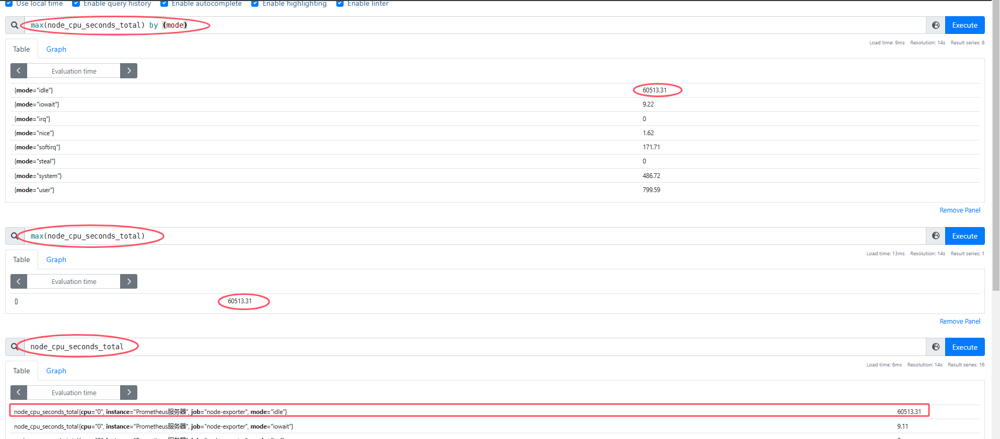

### 2.3 avg 平均值

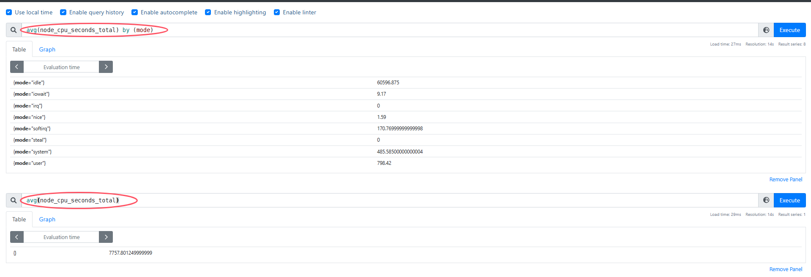

**案例**： cpu 负载 > 80% 触发器
```
100 - (avg by(instance) (rate(node_cpu_seconds_total{mode="idle"}[2m])) * 100) > 80
```
这个PromQL语句用于计算CPU负载，并判断其是否大于80%，下面是详细解释：
* node_cpu_seconds_total{mode="idle"}[2m]：
  * node_cpu_seconds_total是一个指标，用于记录CPU在不同模式下的累计使用时间
  * {mode="idle"} 是标签过滤器，筛选出CPU处于空闲（idle）模式的时间序列
  * [2m] 是时间范围选择器，表示选取过去2分钟内的数据，形成一个区间向量

* rate(node_cpu_seconds_total{mode="idle"}[2m])：
  * rate是PromQL的内置函数，用于计算**区间向量**中每个时间序列的每秒平均增长率。在这里，它计算的是过去2分钟内CPU处于空闲模式时间的平均每秒增长率

* avg by(instance) (rate(node_cpu_seconds_total{mode="idle"}[2m]))：
  * avg是聚合操作符，用于计算平均值
  * by(instance)表示按照instance标签进行分组，计算每个分组内（即每个实例）的CPU空闲时间增长率的平均值

* (avg by(instance) (rate(node_cpu_seconds_total{mode="idle"}[2m])) * 100)：
  * 将每个实例的CPU空闲时间平均增长率乘以100，转换为百分比形式
  * 100 - (avg by(instance) (rate(node_cpu_seconds_total{mode="idle"}[2m])) * 100)：
  * 用100减去CPU空闲时间百分比，得到CPU的使用负载百分比。因为系统的总CPU资源是 100%，空闲时间的补集就是使用负载

* 100 - (avg by(instance) (rate(node_cpu_seconds_total{mode="idle"}[2m])) * 100) > 80：
  * 这是一个关系运算表达式，判断每个实例的CPU负载百分比是否大于80%。如果结果为true，则表示该实例的CPU负载超过了80% 


### 2.4 count 统计数量
* 统计监控数据条目的数量

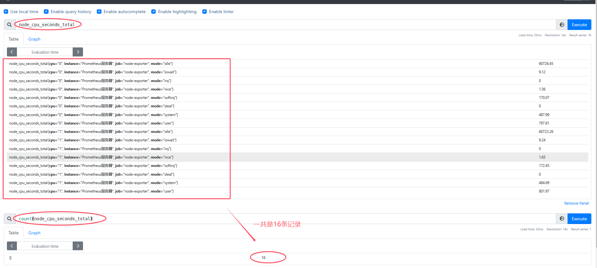


### 2.5 bottomk 统计最小的几个值

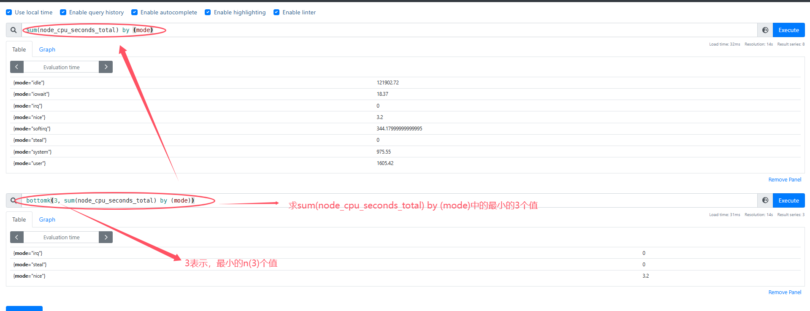

### 2.6 topk 统计最大的几个值
```
topk(3, sum(node_cpu_seconds_total) by (mode))
```
* 同bottomk
* 类似 sql：ORDER BY mode DESC limit 3

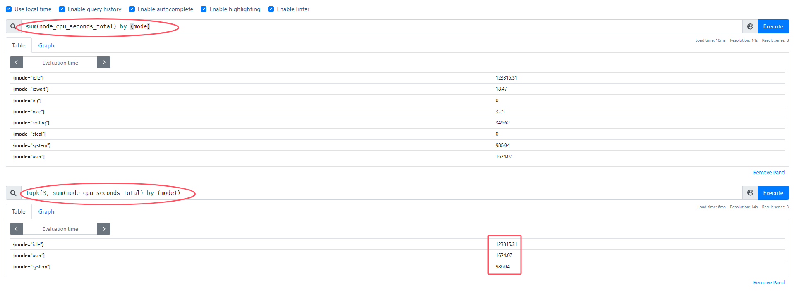


## 3. 基于时间聚合
前面已经学习了如何使用 sum ()、avg () 和相关的聚合运算符从标签维度进行聚合，这些运算符在**一个时间内对多个序列进行聚合**，但是有时候可能想在**每个序列中按时间进行聚合**，例如，使尖锐的曲线更平滑，或深入了解一个序列在一段时间内的最大值
* **面向的是区间向量**

为了基于时间来计算这些聚合，**PromQL提供了一些与标签聚合运算符类似的函数，但是在这些函数名前面附加了_over_time()**：
* avg_over_time (range-vector)：区间向量内每个指标的平均值
* min_over_time (range-vector)：区间向量内每个指标的最小值。
* max_over_time (range-vector)：区间向量内每个指标的最大值。
* sum_over_time (range-vector)：区间向量内每个指标的求和
* count_over_time (range-vector)：区间向量内每个指标的样本数据个数
* quantile_over_time (scalar, range-vector)：区间向量内每个指标的样本数据值分位数
* stddev_over_time (range-vector)：区间向量内每个指标的总体标准差
* stdvar_over_time (range-vector)：区间向量内每个指标的总体标准方差

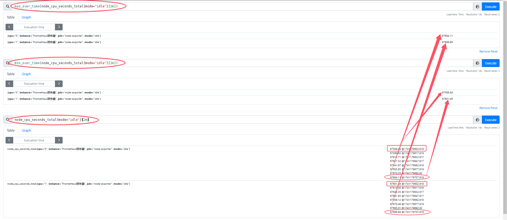

