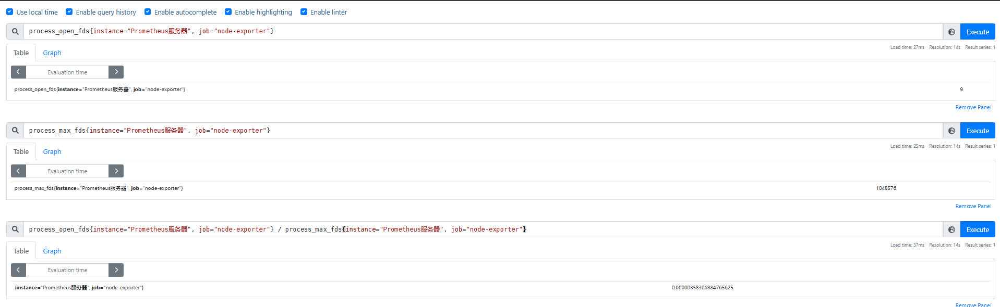

# 向量匹配

在标量和瞬时向量之间使用运算符可以满足很多需求，但是在两个瞬时向量之间使用运算符时，哪些样本应该适用于哪些其他样本？这种瞬时向量的匹配称为向量匹配。Prometheus提供了两种基本的向量匹配模式：one-to-one向量匹配和many-to-one（one-to-many）向量匹配

接下来将介绍在PromQL中有两种典型的匹配模式：一对一（one-to-one），多对一（many-to-one）或一对多（one-to-many）

## 1. 一对一（one-to-one）
一对一匹配模式会从运算符两边表达式获取的瞬时向量依次比较并找到唯一匹配 (**标签完全一致)** 的样本值。默认情况下，使用表达式
```
vector1 <operator> vector2
```
例如当存在样本
```
process_open_fds{instance="Prometheus服务器", job="node-exporter"} 9
process_max_fds{instance="Prometheus服务器", job="node-exporter"} 1048576
```
使用PromQL案例
* 前后两个向量标签完全一致
```
process_open_fds{instance="Prometheus服务器", job="node-exporter"} / process_max_fds{instance="Prometheus服务器", job="node-exporter"} 0.00000858306884765625
```



在操作符两边表达式标签不一致的情况下，可以使用`on (label list)`或者`ignoring(label list)`来修改标签的匹配行为。使用`ignoring`可以在匹配时忽略某些标签。而`on`则用于将匹配行为限定在某些标签之内
```
<vector expr> <bin-op> ignoring(<label list>) <vector expr>
<vector expr> <bin-op> on(<label list>) <vector expr>
```


```
sum by(instance, job)(rate(node_cpu_seconds_total{mode="idle"}[5m])) / on(instance) sum by(instance)(rate(node_cpu_seconds_total[5m]))
```
可以替换为
```
sum by(instance, job)(rate(node_cpu_seconds_total{mode="idle"}[5m])) / ignoring(job) sum by(instance)(rate(node_cpu_seconds_total[5m]))
```


## 2. 多对一和一对多
多对一和一对多的匹配模式，可以理解为**向量元素中的一个样本数据匹配到了多个样本数据标签。在使用该匹配模式时，需要使用group_left或group_right修饰符明确指定哪一个向量具有更高的基数**，也就是说左或者右决定了哪边的向量具有较高的子集。此表达格式为：
```
<vector expr> <bin-op> ignoring(<label list>) group_left(<label list>) <vector expr>
<vector expr> <bin-op> ignoring(<label list>) group_right(<label list>) <vector expr>
<vector expr> <bin-op> on(<label list>) group_left(<label list>) <vector expr>
<vector expr> <bin-op> on(<label list>) group_right(<label list>) <vector expr>
```
**多对一和一对多两种模式一定是出现在操作符两侧表达式返回的向量标签不一致的情况**。因此需要使用`ignoring`和`on`修饰符来明确或限定匹配的标签列表

使用group_left指定左侧操作数组中可以有多个匹配样本
例如，表达式:
```
sum without(cpu)(rate(node_cpu_seconds_total[5m])) / ignoring(mode) group_left sum without(mode, cpu)(rate(node_cpu_seconds_total[5m]))
```
* `sum without(cpu) (rate(node_cpu_seconds_total[5m]))`等价于`sum(rate(node_cpu_seconds_total[5m])) without(cpu)`


* 因为左侧向量中有更多记录或者样本，所以这里使用group_left，左侧比右侧多了`mode`标签，需要将其抹去，然后进行匹配
* 如果左侧向量有更多样本，则使用group_left；反之，使用group_right


* 将上例中的左右两侧向量交换
```
sum without(mode, cpu)(rate(node_cpu_seconds_total[5m])) / ignoring(mode) group_left  sum without(cpu)(rate(node_cpu_seconds_total[5m]))
```


