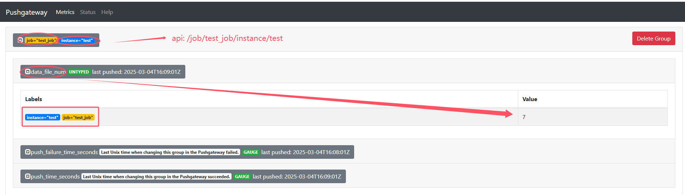
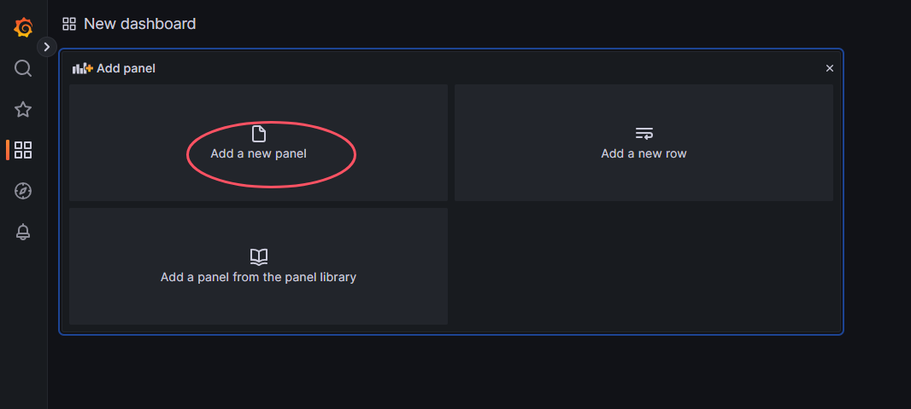

# Pushgateway

## 1. Pushgateway简介
Pushgateway是Prometheus生态中一个重要工具，使用它的原因主要是：
* Prometheus采用pull模式，可能由于不在一个子网或者防火墙原因，导致Prometheus无法直接拉取各个target数据。
* 在监控业务数据的时候，需要将不同数据汇总，由Prometheus统一收集。
* 当exporter不能满足需要时，也可以通过自定义（python、shell、java）监控想要的数据

由于以上原因，不得不使用pushgateway，但在使用之前，有必要了解一下它的一些弊端：
* 将多个节点数据汇总到pushgateway，如果pushgateway挂了，受影响比多个target大。
* Prometheus拉取状态up只针对pushgateway，无法做到对每个节点有效。
* Pushgateway可以持久化推送给它的所有监控数据

因此，即使监控已经下线，prometheus还会拉取到旧的监控数据，需要手动清理pushgateway不要的数据


## 2. Pushgateway安装

### 2.1 二进制


### 2.2 docker
```
docker run -d -p 9091:9091 --name pushgateway prom/pushgateway
```
* image url: docker.1ms.run/prom/pushgateway

## 3. Prometheus配置
配置Prometheus，使其通过使用pull的方式去拉取pushgateway收集到的数据

* 进入到prometheus安装目录
```
cd /data/docker-prometheus
```

* 通过cat在prometheus.yml文件末尾添加
```
cat >> prometheus/prometheus.yml <<"EOF"
  - job_name: pushgateway
    honor_labels: true  #加上此配置，exporter节点上传数据中的一些标签将不会被pushgateway节点的相同标签覆盖
    static_configs:
      - targets: ['192.168.50.120:9091']
        labels:
          instance: pushgateway
EOF
```

* 重载配置
```
curl -X POST http://192.168.50.120:9090/-/reload
```

* 检查


## 4. 向pushgateway推送数据
### 4.1 使用curl
> 正常情况使用Client SDK推送数据到pushgateway(192.168.50.120:9091)，但是还可以curl调用API来管理，例如
```
echo "some_metric 3.14" | curl --data-binary @- http://192.168.50.120:9091/metrics/job/some_job
```
* 登录pushgateway查看，http://192.168.50.120:9091/


* 也可登录pushgateway查看pushgateway的metrics，http://192.168.50.120:9091/metrics


* 到prometheus查看，http://192.168.50.120:9090/graph


> 添加更多更复杂数据，通常数据会带上instance（some_instance为instance名），表示来源位置
```
cat <<EOF | curl --data-binary @- http://192.168.50.120:9091/metrics/job/some_job/instance/some_instance
# TYPE some_metric counter
some_metric{label="value1"} 42
# TYPE another_metric gauge
# HELP another_metric Just an example.
another_metric 2398.283
EOF
```

> 删除某个组下的某实例的所有数据
```
curl -X DELETE http://192.168.50.120:9091/metrics/job/some_job/instance/some_instance
```

> 删除某个组下的所有数据
```
curl -X DELETE http://192.168.50.120:9091/metrics/job/some_job
```

### 4.2 使用Python
安装prometheus_client模块
```
yum install python3-pip
pip install prometheus_client
```
python code
```
from prometheus_client import CollectorRegistry, Gauge, push_to_gateway

registry = CollectorRegistry()
g = Gauge('job_last_success_unixtime', 'Last time a batch job successfully finished', registry=registry)
g.set_to_current_time()
push_to_gateway('localhost:9091', job='batchA', registry=registry)
```
* job_last_success_unixtime：指标名
* set_to_current_time：设置指标的值

## 5. 通过pushgateway实现-监控data目录下的文件数量

### 5.1 shell脚本
```
cat >>/opt/file_num.sh<<"EOF"
#!/bin/sh
FILENUM=`ls -l /data |sed 1d| wc -l`
echo "data_file_num ${FILENUM}" | curl --data-binary @- http://192.168.50.120:9091/metrics/job/test_job/instance/test
EOF
```
* cronjob
```
*/1 * * * * /bin/sh /opt/file_num.sh >/dev/null 2>&1
```




### 5.2 python脚本
```
cat >>/opt/file_num.py<<"EOF"
from prometheus_client import CollectorRegistry, Gauge, push_to_gateway
import os

path = 'data'            # 输入文件夹地址
files = os.listdir(path)  # 读入文件夹
num_png = len(files)         # 统计文件夹中的文件个数

registry = CollectorRegistry()
g = Gauge('python_data_file_num', 'data file num', ['instance'], registry=registry)
g.labels('test').set(num_png)
push_to_gateway('192.168.50.120:9091', job='test_job', registry=registry)
```
* cronjob
```
*/1 * * * * /usr/bin/python3 /opt/file_num.py >/dev/null 2>&1
```


### 5.3 配置告警规则
需求：当/data目录下的文件数量超过5，就触发告警

* 配置Prometheus的告警规则
```
mkdir prometheus/rules
cat >> prometheus/rules/pushgateway.yml <<"EOF"
groups:
 - name: pushgateway
   rules:
   - alert: DataFileNum
     expr: data_file_num > 7
     for: 0m
     labels:
       severity: warning
     annotations:
       summary: 'data数据目录文件数过多'
       description: "data数据目录文件数>7,当前数量:{{ $value }}"
EOF
```
* 更新prometheus.yml，添加告警规则
```
rule_files:
  - "alert.yml"
  - "rules/pushgateway.yml"
  # - "rules/*.yml"
```
* reload prometheus
```
curl -X POST http://192.168.50.120:9090/-/reload
```


### 5.4 将监控添加到Grafana dashboard
* 创建dashboard


* add a new panel


* 配置panel


* 更改panel的title


* 修改dashboard名称


