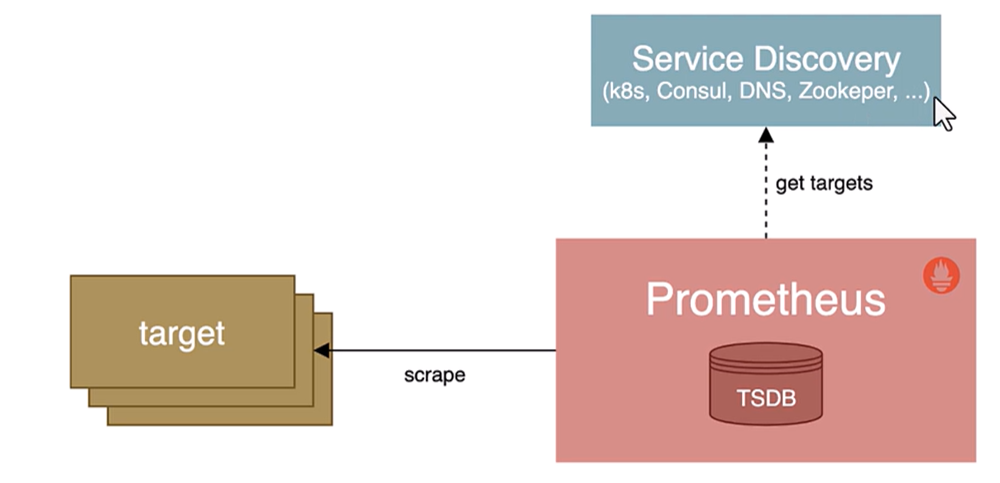

# service discovery

## 1. 概述
接下来将学习Prometheus中是如何使用服务发现来查找和抓取目标的。在Prometheus配置文件中可以通过一个static_configs来配置静态的抓取任务，但是在云环境下，特别是容器环境下，抓取目标地址经常变动的，所以用静态的方式就不能满足这些场景了，还有特别在很多服务器需要监控时。所以需要监控系统能够动态感知这个变化，不可能每次变动都去手动重新配置的，为了应对复杂的动态环境，Prometheus也提供了与基础设施中的服务发现集成的功能



Prometheus 已经支持多种内置的服务发现机制：
* 发现云服务商的VM虚拟机
* Kubernetes上的自动发现
* 通用的服务查找，例如DNS、Consul、Zookeeper或自定义发现机制

可以通过Prometheus配置文件中的scrape_config部分进行配置，Prometheus会不断更新动态的抓取目标列表，自动停止抓取旧的实例，开始抓取新的实例，Prometheus特别适合运行于Kubernetes集群下面，可以自动发现监控目标。
此外大部分服务发现机制还会提供目标的一些元数据，通常都是带有__的前缀，比如标签、注解、服务名等等，可以在relabeling阶段使用这些元数据来过滤修改目标，这些元信息标签在重新标记阶段后被删除。

## 2. 基于文件的服务发现
除了基于Consul的服务发现之外，Prometheus也允许自定义的发现集成，可以通过watch一组本地文件来获取抓取目标以及标签信息，也就是常说的基于文件的服务发现方式

基于文件的服务发现提供了一种更通用的方式来配置静态目标，并作为一个接口插入自定义服务发现机制

它读取一组包含零个或多个 <static_config> 列表的文件，对所有定义的文件的变更通过磁盘监视被检测到并立即应用，文件可以以YAML 或JSON 格式提供。文件必须包含一个静态配置的列表

* JSON格式进行配置
```
[
  {
    "targets": ["<host>", ...],
    "labels": {
      "<labelname>": "<labelvalue>", ...
    }
  },
  ...
]
```
* YAML格式进行配置
```
- targets:
    [ - '<host>' ]
  labels:
    [ <labelname>: <labelvalue> ... ]
```


文件内容会在指定的刷新间隔时间内定期重新读取
```
# Patterns for files from which target groups are extracted.
files:
  [ - <filename_pattern> ... ]
# Refresh interval to re-read the files.
[ <refresh_interval>: <duration> | default = 5m ]
```

### 2.1 创建文件
创建一个用于服务发现的目标文件，在与prometheus.yml文件相同目录下面创建一个名为targets.yml的文件
```
cd /data/docker-prometheus
mkdir prometheus/targets
cat > prometheus/targets/targets.yml<<"EOF"
- targets: ['localhost:9090']
  labels:
    job: prometheus
- targets: ['cadvisor:8080']
  labels:
    instance: Prometheus服务器
    job: cadvisor
- targets: ['192.168.50.120:8080']
  labels:
    instance: test服务器
    job: cadvisor
- targets: ['node_exporter:9100']
  labels:
    instance: Prometheus服务器
    job: node-exporter
- targets: ['192.168.50.120:9100']
  labels:
    instance: test服务器
    job: node-exporter
- targets: ['192.168.50.120:9113']
  labels:
    instance: test服务器
    job: nginx_exporter
- targets: ['192.168.50.120:9121']
  labels:
    instance: test服务器
    job: redis_exporter
- targets: ['192.168.50.120:9419']
  labels:
    instance: test服务器
    job: rabitmq_exporter
- targets: ['192.168.50.120:9216']
  labels:
    instance: test服务器
    job: mongodb_exporter
- targets: ['192.168.50.120:9104']
  labels:
    instance: test服务器
    job: mysqld_exporter
- targets: ['192.168.50.120:9256']
  labels:
    instance: test服务器
    job: process
EOF
```
* springboot.yml
```
cat >prometheus/targets/springboot.yml<<"EOF"
- targets:
  - 192.168.11.62:8081
EOF
```

* blackbox-exporter-tcp.yml
```
cat >prometheus/targets/blackbox-exporter-tcp.yml<<"EOF"
- targets:
  - 192.168.11.61:22
  - 192.168.11.61:9090
EOF
```
* blackbox-exporter-icmp.yml
```
cat >prometheus/targets/blackbox-exporter-icmp.yml<<"EOF"
- targets:
  - 192.168.11.61
  - 192.168.11.62
EOF
```
* domain.yml
```
cat >prometheus/targets/domain.yml<<"EOF"
- targets:
  - qq.com
  - baidu.com
EOF
```